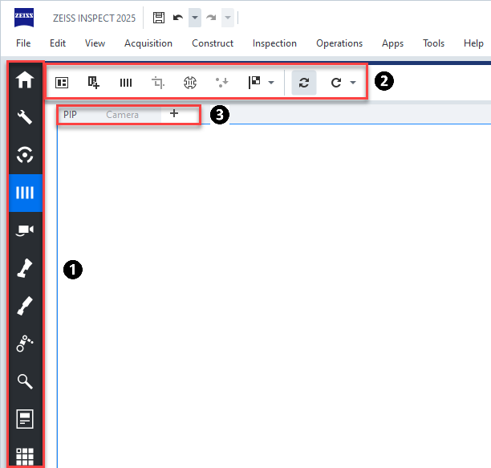
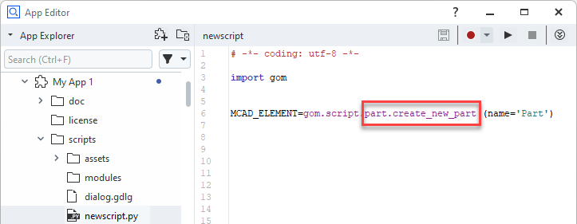
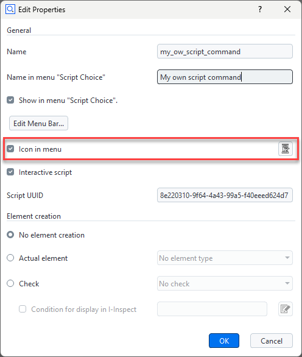
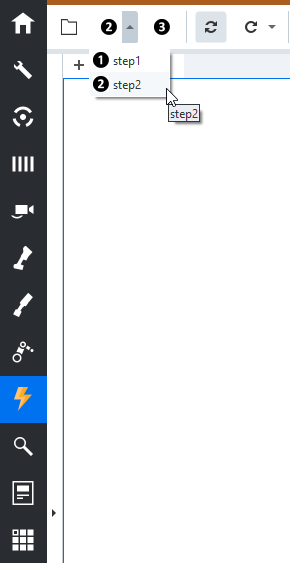

# Adding workspaces to Apps

> Abstract: An App can include a definition for a new workspace. 'Inspection' and 'Reporting' are examples for these workspaces. Although there is no UI based workspace editor yet, it is possible to create one nevertheless with some manual work.

## Workspaces



* ZEISS INSPECT has a set of available workspaces on the left side (1).
* Which workspaces are available depends on the available licenses and the installed Apps.
* A workspace bundles commands etc. thematically. If, for example, the 'inspection' workspace is selected, the toolbar (2) and the view menu (3) above will show everything the user needs to inspect parts, while the 'report' workspace provides tool for report page creation.
* An App can add its own workspace. The 'Blade CMM' App, for example will provide tools for 'Airfoil CMM Data Preparation' - a feature, which is contained in an App and not provided by default because it is rather special.

## Adding workspaces to Apps

> There is no UI based workspace editor yet, but workspace definitions can be added manually.

* An example can be found in the App **'Workspace editor tools'** ([Download](https://software-store.zeiss.com/products/apps/workspace-editor-tools))
* An App is just a ZIP file with a different extension (.addon) containing JSON based object definitions.
* It can be unpacked, edited and packed again with a new workspace definition.

### Step 1: Unpack the App

* Use the tool of your choice to unpack the App file.
* We recommend 7-zip for that task, but every other zip tool will do the job, too.
* If you want to perform these tasks often, you can register your ZIP tool in the Windows "Choose default apps by file type" settings. Then, instead of unpacking and packing the App again for each edit, you can fiddle with the App content directly from the ZIP tool:

  

### Step 2: Create a workspace folder inside the App

The workspace definitions must be placed in a folder named `workspaces`. A separate folder must be created for each workspace. The folder must be named according to the workspace name, i.e.

`My App/workspaces/<workspace>`

### Step 3: Add a workspace definition file

> The `<workspace>.json` file contains the complete workspace definition.

Add a workspace definition file must be added to the new workspace folder, i.e.

`My App/workspaces/<workspace>/<workspace>.json`

**Example:** From the App 'Airfoil CMM Data Preparation':

~~~
{
  "alignment_section": true,
  "classification": {
    "keywords": [ "AIRFOIL", "CMM" ],
    "main_intention": "ACQUISITION"
  },
  "color": [ 170, 93, 30 ],
  "default_visible_tabs": [
    "diagram",
    "section_view",
    "table",
    "pip"
  ],
  "icon": "cmd_mode_eval_blade_cmm",
  "recalc_section": true,
  "sort_index": "19",
  "token": "airfoil_cmm_data_preparation",
  "workflow_commands": [
    "sys.import_file",
    "[separator]",
    "userscript.Blade_CMM__ProjectSetup__Project_Setup",
    "inspect.tb_create_blade_stylus_correction_cmd_group",
    "primitive.create_fitting_plane_mp_none",
    "inspect.tb_create_profile_section_by_projection_cmd_group",
    "[separator]",
    "userscript.Blade_CMM__AutoPilot__AutoPilot"
  ],
  "uuid": "711632f6-7444-4e66-bf21-00cdd153d535"
}
~~~

#### "uuid"

A unique id of the workspace.

> Please do not define the UUID manually, but use a UUID generator like Online UUID Generator to generate a fresh, truly unique one!

#### "color"

RGB color of the workspace toolbar background. This default may be overwritten by themes, so e.g. in dark theme the toolbar will be colored in rgb(51,51,51) always.

#### "recalc_section"

True, if the toolbar should contain a section for recalculation commands

#### "alignment_section"

True, if the toolbar should contain a section for alignment commands.

#### "sort_index"

Position of this workspace in the list of workspaces. If the element `sort_index` is not provided in `<workspace>.json`, the workspace will be appended to the end of the workspace list (which is often fine).

#### "icon"

The name of an icon file (for ZEISS internal use only) or an icon definition.

Workspace icon definitions can be added with the following procedure:

* Choose an icon file in one of the widely supported formats (png, jpg, ...). The Qt library functions are used to read image data, so you can have a look at the related Qt documentation to see the list of supported image formats.
* Install the App 'Workspace editor tools' and use the script in 'Apps/Tools/Workspace editor' to create a base64 encoded file of this icons data:

  

* Insert the resulting file content as a text item into the icon property:

~~~
{
  "uuid": "711632f6-7444-4e66-bf21-00cdd153d535",
  ...
  # The icon definition contains the content of the created encoding as string enclosed in '"'
  "icon": "x8Royf4mIiJq8v3YBiIj6IRvW1yr6DhnwUw45R0RErxcr+kREALZDBZvXLgYREdGZHBx1h4iIiIiI...",
  ...
}
~~~

Some icon guidelines

* Use only black/white icons to match with the overall application style
  * Black color: HEX (#333333), RGB (51,51,51)
  * White color: HEX (#FFFFFF), RGB (255,255,255) 
* Use image formats that support transparency (e.g. '.png')
* Image size:
  * preferably from 24x24 px (minimum, for script icons) to 64x64 px (recommended for workspace icons) 
  * Try NOT to use any form of compression
* Set the workspace (and scripts) icons to look good on a bright background
  * Normally, this means just a black icon with transparent background
  * To look good on darker background you have two options:
    1. You put a bright (white) padding around the icon, so it is still visible on dark backgrounds
    2. You let the software automatically invert the icon to white color. The icons will get autobrightened, if the icon contains ONLY the standard black color (see above), and no bright colors (Lightness > 127)
* Example

  

  * (1) = Icon with padding, stays the same in all modes
  * (2) = Icon in pure #333333 black, gets auto-brightened in dark modes

#### "workflow_commands"

Commands on the left side of the workspace toolbar. These command can either be
* the name of a "hardcoded" GOM command,
* the name of a script command (a command starting a Python script)
* a special tag like '[separator]' for a separator in the command toolbar.

The commands here will become entries in the toolbar from the left to the right. To get the name of the command, you can record it in the script editor and omit the 'gom.script' prefix:



This works for scripts, too, if a script is executed from the 'Apps' menu while the script editor is in recording mode.

#### "sensor_commands"

Commands on the right side of the workspace toolbar. Same principle as above.

#### "default_visible_views"

Views that are visible per default, e.g.  adding "right_docking_area" shows the properties/toolbox window(star) on right side, which is collapsed by default. ( (star) as long as the default_view_layout_right_ isn't changed). To investigate the name of the view to enter here, start script recording again and switch to that view in the applications UI. This will record a command containing that name:


#### "default_visible_tabs" 

Views that are visible as tabs per default → these are still initially collapsed until adding them to "default_visible_views". 

### Step 4: Test your workspace

* Save that new content in the App.
* Install the App.
* Look for a new workspace in the workspace toolbar on the left side of the application.

## Guidelines

### Icon guidelines
* SVG Format, with a page size of 16x16. E.g. Inkscape page template "Icon 16x16"
* Only use two colors:
  * white (#ffffff) background
  * black (#333333) foreground
* For proper appearance in dark themes:
  * Only use "black" color, so the icon will get inverted automatically in dark mode
    * Use a white padding of 0.5px on each side

## FAQ

### How can I add icons to the workspace toolbar ?

You can only add commands to the toolbar. The commands will bring their own icons. For scripts, which can be added like commands, a custom script icon can be set in the script editor via the 'edit properties' feature in the right mouse menu of the script:



### How can I group scripts in the workspace toolbar?

Scripts in a common folder can be added to the workspace toolbar as a group .

Example:

```
:caption: App folder structure

Workspace editor tools
  |
  |-- Scripts
  |    |-- my_script.py
  |    |-- myworkflow
  |          |-- step1.py
  |          |-- step2.py
  ...  
```

```
:caption: Sample Workspace.json

{
    ...
    "workflow_commands": [
        "sys.import_file",
        "userscript.group_myworkflow",
        "userscript.my_script"
    ],
    ...
}
```



The scripts `step1.py` and `step2.py` in the folder `myworkflow` are added as a dropdown menu to the toolbar. If the dropdown menu is closed, the script which was executed last is shown.
