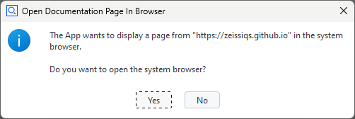

# Documenting Apps

```{note}
The App documentation is part of the packaged App.
```

```{eval-rst}
.. toctree::
   :hidden:

   assets/Releasenotes.md
```

## Terminology


| Index | Item                           | Description                                                | Origin                                                              |
| ----- | ------------------------------ | ---------------------------------------------------------- | ------------------------------------------------------------------- |
|     1 | Title                          | App title                                                  | 'Title' field in the App.<br>Set during App creation.                  |
|     2 | Company                        | Company which maintains the App                            | Company the uploading account belongs to.<br>Set during App creation.  |
|     3 | App description                | App short description                                      | 'Description' field in the App.<br>Set during App creation.            |
|     4 | Splash description             | Some information about the App,<br>e.g. for advertising it | doc/README.md from the App.<br>See below how to edit it.               |
|     5 | Link to complete<br>documentation | Complete App documentation | Something referenced from within the doc/README.md.<br>Can be a PDF, a link to some external site, ... | 

## App documentation structure

```{note}
An App (`.addon` file) is technically a ZIP file. See [App file format](../app_file_format/app_file_format.md) for details.
```

* Mandatory contents:
  * `doc/README.md` &mdash; this will be rendered as the product's splash description ad.
  * `Releasenotes.md` and `Releasenotes.pdf` &mdash; The Markdown file allows viewing in the App Editor while the PDF file is used in the ZEISS Quality Software Store. 
* Recommended contents:
  * `Documentation.md` (and optional `Documentation.pdf`) &mdash; full App documentation

The App can contain an arbitrary number of additional files in the `doc` folder referenced from within the files `README.md` or `Documentation.md`.

### Example

* Documentation related content of the App 'Python API Examples':

    

* The README.md is the starting point for rendering the App's splash description and will reference other files:

    

* This will result in the following splash description:

    

## Markdown

```{note}
See [markdown guide](https://www.markdownguide.org/basic-syntax/) for a brief description of the markdown format.
```

See [ZEISS Quality Software Store &mdash; FileSelectionAndFiltering](https://software-store.zeiss.com/products/apps/FileSelectionAndFiltering) for example.


A markdown editor/viewer is integrated in the ZEISS INSPECT App editor.

See [Releasenotes template](assets/Releasenotes.md).

## Portable Document Format (PDF)

The standard expression to reference a PDF from `doc/README.md` is:

```{code-block} markdown
:caption: doc\/README.md

See [Documentation](Documentation.pdf) for detailed description.
```

## Converting Markdown files to PDF

The [Visual Studio Code](https://code.visualstudio.com/) extension [Markdown PDF](https://marketplace.visualstudio.com/items?itemName=yzane.markdown-pdf) allows to convert a Markdown file to PDF.

## Link to external documentation


You can create a link to a website providing App documentation by adding a JSON object `"documentation": "<url>"` to the App's `metainfo.json` file:

```{code-block}
:caption: Example documentation link in `metainfo.json`

{
    ...
    "documentation": "https://zeissiqs.github.io/zeiss-inspect-addon-api/2025/index.html",
    ...
}
```

If a documentation link is defined in an App, each dialog window will provide a help button in its title bar.


When the help button is clicked, the user must confirm that the linked documentation pages is openened in the system's web browser.


