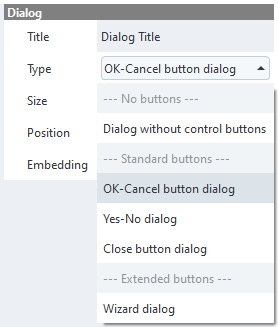
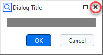
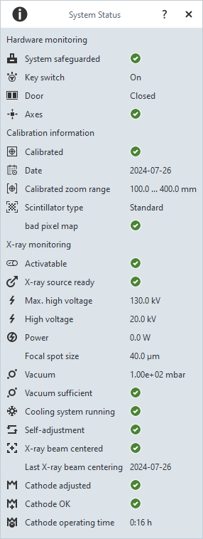

---
myst:
   html_meta:
      "description": "ZEISS INSPECT 2025 App Python API Specification - Frequently Asked Questions"
      "keywords": "Metrology, ZEISS INSPECT, Python API, GOM API, Scripting, Add-ons, Apps, Specification, Documentation"
    
   suppress_warnings:
      ['myst.header']
---

# Frequently asked questions

If you did not find an answer here, you might want to check <a href="https://qualityforum.zeiss.com/forum/8-customizations/" target="_blank" rel="noopener noreferrer">ZEISS Quality Forum - Customizations</a>.

## Where are Apps located in the file system?

Apps which are edited are located in `C:\Users\<USERID>\AppData\Roaming\GOM\<VERSION>\gom_edited_addons` (or `%APPDATA%\GOM\<VERSION>\gom_edited_addons`, respectively). There is a subfolder for each App named by its UUID.

When editing is finished, an App file (see [App file format](../app_file_format/app_file_format.md)) is created and saved in `C:\Users\<USERID>\AppData\Roaming\GOM\<VERSION>\gom_addons`.

The connected folders are saved as Windows shortcuts in `C:\Users\<USERID>\AppData\Roaming\GOM\<VERSION>\gom_script_external_folders`.
## Where is the Python installation used by ZEISS INSPECT located?

Token: `gom.app.python_directory`

* For GOM Inspect <= 2022: `C:\Program Files\GOM\<VERSION>\python`
* For ZEISS INSPECT >= 2023: `C:\Program Files\Zeiss\INSPECT\<VERSION>\python`

The module search path also includes 
* `C:\Program Files\Zeiss\INSPECT\<VERSION>\lib\python`
* `%APPDATA%\Python\<PYTHON_VERSION>\site-packages`
* For each Python wheel used in an App: `%APPDATA%\gom\<VERSION>/gom_python_wheel_cache/<WHEEL>`
  (see [How are Python wheels handled by ZEISS INSPECT?](#how-are-python-wheels-handled-by-zeiss-inspect) for details)
* If an App is in editing mode: `%APPDATA%\gom\gom_edited_addons\<ADDON_UUID>\scripts`
where `%APPDATA` is expanded to `C:\Users\<USERID>\AppData\Roaming`.

You can print the module search path in an App using:
```{code-block} python
import sys

for p in sys.path:
	print(p)
```

## How are Python wheels handled by ZEISS INSPECT?

ZEISS INSPECT maintains a cache folder for Python wheels and wheelhouses in `%APPDATA%\gom\<VERSION>/gom_python_wheel_cache`.

* When a wheel/wheelhouse is installed in an App, it is copied into the App's `scripts/modules` folder and installed into the cache folder.
* When an App containing wheels/wheelhouses is installed, those are installed into the cache folder.
* When a script from an App is started, its wheels/wheelhouses are installed into the cache folder. The script uses the cache folder named according to the wheel/wheelhouse filename in its `scripts/modules` folder.

## How can I install missing Python wheels by a script?

The following script tries to import the modules listed in `required_modules`. A `ModuleNotFoundError` exception is thrown if a module has not been installed into the App yet. In this case, the script will try to install it. The script has to be restarted in order to make any newly installed modules available.

```{code-block} python
import gom
import sys
import os
import subprocess
import importlib
# Put your Python modules here
# import <module> => [..., '<module>', ...]
# import <module> as <alias> => [..., [<module>, <alias>], ...]
required_modules = ['openpyxl', ['numpy', 'np']]
def install_modules(modules): 
    module_installed = False
    
    # Build Add-on module installation path
    addon = gom.api.addons.get_current_addon()
    addon_id = addon.get_id()
    addon_path = os.path.join(gom.app.user_edited_addon_directory, addon_id, 'scripts', 'modules')
    
    for module in modules:
        try:
            if isinstance(module, str):
                print(f'import {module}')
                mname = module
                importlib.import_module(module)
            elif isinstance(module, list):
                globals_dict = globals()
                print(f'import {module[0]} as {module[1]}')
                mname = module[0]
                globals_dict[module[1]] = importlib.import_module(module[0])
            else:
                print(f"{module} has an unknown data type - expecting either '<module_name>' or '[<module_name>, <alias>]'")
                
        except ModuleNotFoundError:
            # sys.executable ensures that the ZEISS INSPECT Python installation is used
            res = subprocess.check_call(
                [sys.executable, '-m', 'pip', 'download', '--dest', addon_path, mname]
            )
            if (res == 0):
                module_installed = True
                gom.script.sys.update_addon_database()
            else:
                print(f"Attempt to install package {module} automatically failed.")        
                sys.exit(1)
    
    if module_installed:
        print("---> Package installation successful, please restart script. <---")
        sys.exit(0)
install_modules(required_modules)
# Add your actual script here
```

## How can I upgrade the pip version used in ZEISS INSPECT?

In rare cases, a certain Python package cannot be installed, because it requires a newer version of [pip](https://pip.pypa.io/en/stable/) than currently installed with ZEISS INSPECT.

To upgrade pip:
* Go into the [ZEISS INSPECT Python folder](#where-is-the-python-installation-used-by-zeiss-inspect-located)
* Run `.\python.exe -m pip install --upgrade pip`

You can query the installed pip version with:
```{code-block} python
import pip
print(pip.__version__)
```

```{caution}
You are changing the pre-installed Python environment at your own risk! 
```

## How do I fix a `unicode error` when trying to access a file?  

An error message such as `SyntaxError: (unicode error) 'unicodeescape' codec can't decode bytes in position xx: truncated \UXXXXXXXX escape` is cause by backslashes in a file system path. Always use forward slashes instead. See also [ZEISS Quality Tech Guide: How Do I Select and Filter Files in Python Scripts](https://techguide.zeiss.com/en/zeiss-inspect-2023/article/how_to_select_and_filter_files_in_python_scripts.html).

## How can I update the Apps after changes made outside of ZEISS INSPECT?

After creating, modifying or deleting an App outside of ZEISS INSPECT, you can use `gom.script.sys.update_addon_database()` to update the internal App database. 

## How can I stop script execution?

In a user defined dialog, you can call `gom.script.sys.close_user_defined_dialog (dialog=\<your_dialog\>)`.

In general, you can use

```{code-block} python
import sys

# ...

sys.exit(0)

```

## How do I filter nominal, actual or inspection elements?

Use `print (gom.app.project.<element_type>.__doc__)` where you replace `<element_type>` by `actual_elements`, `nominal_elements` or `inspection` as needed to get the available properties.

To show all actual elements by name and type:

```{code-block} python
for element in gom.app.project.actual_elements:
    print (f'{element.name} - type: {element.type}')
```

You can create a loop in Python to iterate over the elements as shown above and apply a comparison to their attributes, but there is a faster solution!

The `filter()` method handles this far more efficiently!

### Examples for filtering actual elements

```{code-block} python
group = gom.app.project.actual_elements

f = group.filter("is_selected", True)
print (f) # array of elements matching the filter criterion 'is_selected == True'

f = group.filter("type", "plane")
print (f) # array of elements matching the filter criterion 'type == Plane'
```

### Examples for filtering nominal elements

```{code-block} python
group = gom.app.project.nominal_elements

f = group.filter("is_visible", True)
print (f) # array of elements matching the filter criterion 'is_visible == True'

f = group.filter("type", "cad")
print (f) # array of elements matching the filter criterion 'type == cad'
```

### Examples for filtering inspection elements

```{code-block} python
group = gom.app.project.inspection

f = group.filter("is_element_modified_since_import", True)
print (f) # array of elements matching the filter criterion 'is_element_modified_since_import == True'

f = group.filter("type", "cad")
print (f) # array of elements matching the filter criterion 'type == surface_comparison'
```

## How can I access the coordinates of a selection on a mesh?


The token `gom.app.project.parts['<part name>'].actual.selection.coordinate` provides a `gom.Array` of the selected vertices. Likewise, `gom.app.project.parts['<part name>'].actual.selection.normal` gives the corresponding normals and `gom.app.project.parts['<part name>'].actual.selection.triangle` the triangles defining the mesh.

```{code-block} python
import gom
import numpy as np

print(gom.app.project.parts['Training Object'].actual.selection.coordinate)
# Output: gom.Array (element=gom.app.project.parts['Training Object'].actual.selection.coordinate, shape=(1, 1343, 3))

print(gom.app.project.parts['Training Object'].actual.selection.normal)
# Output: gom.Array (element=gom.app.project.parts['Training Object'].actual.selection.normal, shape=(1, 1343, 3))

# Typically a numpy-array is used for further processing
selection = np.array(gom.app.project.parts['Training Object'].actual.selection.coordinate)

print(selection.shape)
# Output: (1, 1343, 3)

print(selection)
# Output:
# [[[-2.41255735e+01  2.21117734e+01 -1.91864308e+01]
#  [-2.45970797e+01  2.21050666e+01 -1.97100373e+01]
#  [-2.81128953e+01  2.20834014e+01 -2.04692317e+01]
#  ...
#  [-3.93854225e+01  2.09585465e+01  8.64908297e-02]
#  [-3.96552365e+01  2.10394088e+01  3.26750288e-03]
#  [-4.00649288e+01  2.07525728e+01  7.25684079e-02]]]
```

This can be used to create a <a href="../../python_api/scripted_elements_api.html#surface">scripted surface element</a> from a selection.

```{warning}
The triangles returned by `gom.app.project.parts['<part name>'].actual.selection.triangle` are provided as indices to vertices of the global mesh. The helper function [localize_triangles](assets/localize_triangles.py) remaps these indices to vertices of the local (selected) mesh.
```

## How do I check if a dialog was closed with 'Ok', 'Yes'/'No' or 'Close', respectively? (And not with 'Cancel' or by closing the dialog window.)





Closing a dialog window or pressing the 'Cancel' button raises a `gom.BreakError` exception. To check if any type of dialog was closed via the window close control (see figure) or via the 'Cancel' button (in case of the 'Ok/Cancel' dialog type), use the following code:

```{code-block} python
try:
	RESULT = gom.script.sys.show_user_defined_dialog (dialog=DIALOG)
except gom.BreakError as e:
	print("Dialog window was closed or 'Cancel' button was pressed")
else:
	print("'Ok' button was pressed")
```

## How can I retrieve dialog results as a Python dictionary?

```{code-block} python
print (RESULT.__dict__['__args__'][0])
# example output: {'distance': 2.0, 'label': None}
```

See [User-defined dialogs / Executing dialogs / Dialog results](../python_api_introduction/user_defined_dialogs.md#dialog-results) for more details.

## How can I use an image from a script resource file in a user defined dialog?

You add your image file as a resource to the App:


You create a dialog file with an [Image widget](../python_api_introduction/user_defined_dialogs.md#image-widget), but without setting the actual image in the dialog editor.

In the Python script, you assign the resource as data to the image widget object:

```{code-block} python
import gom

DIALOG=gom.script.sys.create_user_defined_dialog (file='dialog.gdlg')

#
# Event handler function called if anything happens inside of the dialog
#
def dialog_event_handler (widget):
	pass

DIALOG.handler = dialog_event_handler

DIALOG.image.data = gom.app.resource[":example.png"]

RESULT=gom.script.sys.show_user_defined_dialog (dialog=DIALOG)
``` 

## How can I convert an embedded XML dialog definition into JSON format (optionally as separate file)?

1. Ensure that the dialog command line is identical to how the app editor would create it, i.e. 

   `DIALOG=gom.script.sys.create_user_defined_dialog (content=...`
   
2. Double-click the XML text to open the Dialog Editor (only works if you did 1.)
3. Close the Dialog Editor with 'Ok' to convert the XML to the newer JSON representation embedded in the script
4. Optional: On the JSON representation: RMB ► Tools ► Convert Dialog To .gdlg File

## How can I get the position of a label and apply it to another label? 

You can use `gom.script.cad.set_label_position()` to set the offset of the new label to the offset of the old label:

```{code-block} python
label_old = gom.app.project.inspection['Surface comparison 1'].deviation_label['Surface comparison 1.1']
label_new =gom.app.project.inspection['Surface comparison 1'].deviation_label['Surface comparison 1.2']

gom.script.cad.set_label_position(elements = [label_new], offset = label_old.label_offset_in_3d_view)
```

`offset` has the type `gom.Vec3d`.

## How can I conditionally set the label (border) color?

In the label properties, you can create a new label template and change the background color to 'dynamic'. This allows to add an expression in a Python-like syntax, e.g.

```{code-block} python
if result_dimension < result_dimension.upper_tolerance_limit:
    return color('#00ff5e')
else:
    return color('#ff0000')
```

See also [ZEISS Quality Tech Guide: Edit Expression (label background color)](https://techguide.zeiss.com/en/zeiss-inspect-2023/article/dlg_edit_dynamic_label_background_color_expression.html).

## How do I check if the sensor warm-up is completed or how long it will take, respectively?

```{code-block} python
remaining_warmup_time_in_seconds = gom.script.atos.wait_for_sensor_warmup (timeout = my_timeout)
```

The function blocks until the sensor is ready or the timeout specified with `my_timeout` occurs.

## How can I get the CT scanner's system status &mdash; including cathode operation time?



The command `gom.script.ct.get_system_status()` provides the same information as the System Status dialog. The actual content depends on the CT scanner model.

Example (ZEISS METROTOM 1):

```{code-block} python
print(gom.script.ct.get_system_status())
# Example output:
# {'cathode_operation_time': 1727372, 'high_voltage_in_kv': 0.0, 'is_activatable': True,
# 'is_cooling_system_running': True, 'is_key_switch_ok': True, 'is_self_adjustment_running': False,
# 'is_system_safeguarded': True, 'is_xray_source_ready': True, 'max_high_voltage_in_kv': 160.0,
# 'power_in_w': 0.0}
```

`cathode_operation_time` is given in seconds.

(Added in SW2023 Service Pack2)

## Can I use the Python package `pdfplumber` in an App?

Yes, [pdfplumber](https://pypi.org/project/pdfplumber/) can be installed with the [Python Package Installer](../using_app_editor/using_app_editor.md#installing-python-packages) and used without any known limitations.

## Can I use the Python package `pywin32` in an App?

As reported in several [pywin32 issues](https://github.com/mhammond/pywin32/issues), installing `pywin32` fails in many cases. The ZEISS INSPECT Python environment is affected, too.
`ModuleNotFoundError: No module named 'pywintypes'` is also caused by a missing or failed  `pywin32` installation.

Some Python packages (such as [xlwings](#can-i-use-xlwings-in-an-app)) require pywin32.

## Can I use `xlwings` in an App?

Basically no, because [xlwings](https://pypi.org/project/xlwings/) depends on `pywin32` &mdash; see [Can I use the Python package `pywin32` in an App?](#can-i-use-the-python-package-pywin32-in-an-app).

If compatibility to `xlwings` is not required, you might want to use [openpyxl](https://pypi.org/project/openpyxl/) instead (see <a href="https://github.com/ZEISS/zeiss-inspect-app-examples/blob/main/AppExamples/misc/ExcelExample/doc/Documentation.md">Excel import/export example</a>).

## How do I use a C# / .NET library in an App?

First you have to install the [Python.NET](https://pypi.org/project/pythonnet/) package in your App.

Here is a simple C# library source code example: 

```{code-block} csharp
:caption: Example&colon; Adder.cs

namespace MyDotNetClassLib
{
    public class Adder
    {
        public string className = "Adder";
        public static int StaticAdd(int left, int right)
        {
            return left + right;
        }
        public int Add(int left, int right)
        {
            return left + right;
        }
    }
}
```

This code has been compiled into the library `MyDotNetClassLib.dll`.

The following example Python script uses methods and members of this library:

```{code-block} python
:caption: Example&colon; dotnetlibtemplate.py

import gom
import clr # .NET Common Language Runtime (provided by Python.NET package)
from System import Console
	
import sys
sys.path.append('.')                   # append path to the DLL file
clr.AddReference("MyDotNetClassLib")   # name of the assembly (usually the DLL filename without extension .dll)
from MyDotNetClassLib import Adder     # import the module (the C# namespace)

print()
print("hello from python")

# execute a C# function
Console.WriteLine("hello from C#")

# call the static method StaticAdd() of class Adder from our MyDotNetClassLib library
print(f"My C# Adder.StaticAdd(1,2): {Adder.StaticAdd(1,2)}")

# create an object of the class Adder...
adder = Adder()

# ... call its Add() method
print(f"My C# adder.Add(3,4): {adder.Add(3,4)}")

# ... read the member variable className
print(f"My C# adder.className: {adder.className}")

# ... write and read back the member variable className
adder.className = "Renamed Adder"
print(f"My C# adder.className: {adder.className}")
```

This example is based on <a href="https://stackoverflow.com/questions/7367976/calling-a-c-sharp-library-from-python/" target="_blank" rel="noopener noreferrer">Stack Overflow: "Calling a C# library from python"</a>. 

See [Python.NET documentation](https://pythonnet.github.io/pythonnet/index.html) for more details.
