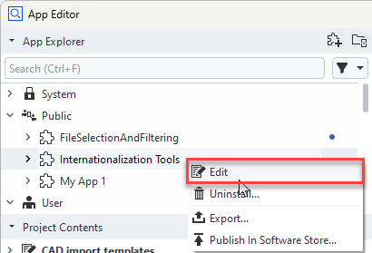
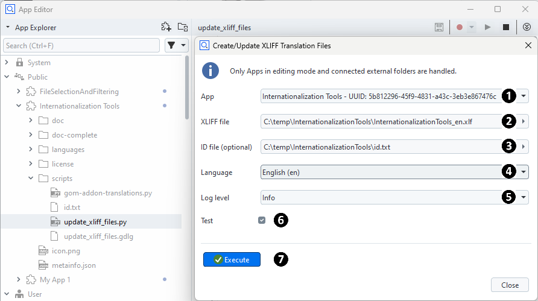
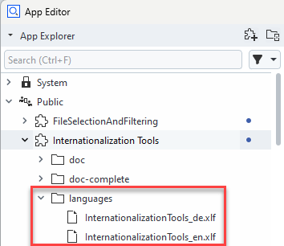
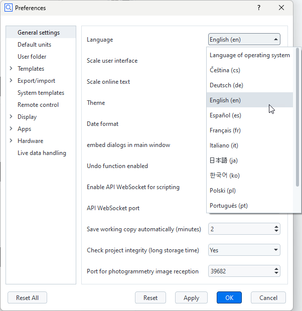

# Localization of Apps

## Writing translatable scripts

### User-defined script dialogs

When adding a user defined script dialog to a script, since software version 2022 the resulting code is in JSON compatible format and will contain translation entries for all translatable texts automatically. The user does not have to care for these entries manually. They are kept consistently when the dialog is edited again and will lead to translation file entries (see below).

``` Python
DIALOG=gom.script.sys.create_user_defined_dialog (dialog={
    "content": [
        [
            {
                "columns": 1,
                "monospace": False,
                "name": "log",
                "rows": 1,
                "save_dialog_title": {
                    "id": "",
                    "text": "Save Log File",
                    "translatable": True
                },
                "scroll_automatically": True,
                "show_save": False,
                "tooltip": {
                    "id": "",
                    "text": "",
                    "translatable": True
                },
    ...
    )
```

### Text in scripts

Texts in scripts have to be tagged as translatable via using the `tr ()`  function. During translation file generation, these texts will be processed and later replaced at runtime with the available translations.

    print (tr ('This text will be translated'))


## Translating scripts

### Generating translatable XLIFF files

💡 Scripts are using standard XLIFF files to access translations in different languages.

#### Install App 'Internationalization Tools'

* Install the App 'Internationalization Tools' via ZQS Store (([Download](https://software-store.zeiss.com/products/apps/internationalization-tools)) or the Install/Uninstall Apps dialog.

#### Switch App into 'Edit' mode

* Select the App the translations should be added to.
* Switch it into 'Edit' mode:

    

#### Execute script 'Update XLIFF files'


* Execute script 'Update XLIFF files' from App 'Internationalization'.
* Select the App with the translations which shall be generated or updated (1)
* Select the translation file which shall be generated or updated (2)
* Optional: Select the ID file, which contains the number of the next available message ID. (3)
* Set language identifier for which translation file will be generated (4)
* Set the log level - log output will be written to the App Editor console. (5)
* Check 'Dry-Run' if you want to try execution without modifying files. (6)
* Press 'Execute' (7)

    
    
    **Log output:**
    
    ```
    INFO:Update script translations
    INFO:--------------------------
    INFO:Add-on source directory: C:/Users/<USERID>/AppData/Roaming/gom/2023/gom_edited_addons/5b812296-45f9-4831-a43c-3eb3e867476c
    INFO:XLIFF file: C:/temp/InternationalizationTools/translations_en.xlf
    INFO:*** DRY RUN ***
    INFO:Loading existing XLIFF file: C:/temp/InternationalizationTools/translations_en.xlf
    INFO:Processing C:/Users/<USERID>/AppData/Roaming/gom/2023/gom_edited_addons/5b812296-45f9-4831-a43c-3eb3e867476c\icon.png
    INFO:Processing C:/Users/<USERID>/AppData/Roaming/gom/2023/gom_edited_addons/5b812296-45f9-4831-a43c-3eb3e867476c\metainfo.json
    INFO:Processing C:/Users/<USERID>/AppData/Roaming/gom/2023/gom_edited_addons/5b812296-45f9-4831-a43c-3eb3e867476c\doc\README.md
    INFO:Processing C:/Users/<USERID>/AppData/Roaming/gom/2023/gom_edited_addons/5b812296-45f9-4831-a43c-3eb3e867476c\doc\README.pdf
    INFO:Processing C:/Users/<USERID>/AppData/Roaming/gom/2023/gom_edited_addons/5b812296-45f9-4831-a43c-3eb3e867476c\doc-complete\appdata_access.png
    INFO:Processing C:/Users/<USERID>/AppData/Roaming/gom/2023/gom_edited_addons/5b812296-45f9-4831-a43c-3eb3e867476c\doc-complete\edit_mode.png
    INFO:Processing C:/Users/<USERID>/AppData/Roaming/gom/2023/gom_edited_addons/5b812296-45f9-4831-a43c-3eb3e867476c\doc-complete\language_preferences.png
    INFO:Processing C:/Users/<USERID>/AppData/Roaming/gom/2023/gom_edited_addons/5b812296-45f9-4831-a43c-3eb3e867476c\doc-complete\README.md
    INFO:Processing C:/Users/<USERID>/AppData/Roaming/gom/2023/gom_edited_addons/5b812296-45f9-4831-a43c-3eb3e867476c\doc-complete\start_from_menu.png
    INFO:Processing C:/Users/<USERID>/AppData/Roaming/gom/2023/gom_edited_addons/5b812296-45f9-4831-a43c-3eb3e867476c\doc-complete\update_xliff.png
    INFO:Processing C:/Users/<USERID>/AppData/Roaming/gom/2023/gom_edited_addons/5b812296-45f9-4831-a43c-3eb3e867476c\doc-complete\xliff_files.png
    INFO:Processing C:/Users/<USERID>/AppData/Roaming/gom/2023/gom_edited_addons/5b812296-45f9-4831-a43c-3eb3e867476c\languages\InternationalizationTools_cs.xlf
    INFO:Processing C:/Users/<USERID>/AppData/Roaming/gom/2023/gom_edited_addons/5b812296-45f9-4831-a43c-3eb3e867476c\languages\InternationalizationTools_de.xlf
    INFO:Processing C:/Users/<USERID>/AppData/Roaming/gom/2023/gom_edited_addons/5b812296-45f9-4831-a43c-3eb3e867476c\languages\InternationalizationTools_en.xlf
    INFO:Processing C:/Users/<USERID>/AppData/Roaming/gom/2023/gom_edited_addons/5b812296-45f9-4831-a43c-3eb3e867476c\languages\InternationalizationTools_es.xlf
    INFO:Processing C:/Users/<USERID>/AppData/Roaming/gom/2023/gom_edited_addons/5b812296-45f9-4831-a43c-3eb3e867476c\languages\InternationalizationTools_fr.xlf
    INFO:Processing C:/Users/<USERID>/AppData/Roaming/gom/2023/gom_edited_addons/5b812296-45f9-4831-a43c-3eb3e867476c\languages\InternationalizationTools_it.xlf
    INFO:Processing C:/Users/<USERID>/AppData/Roaming/gom/2023/gom_edited_addons/5b812296-45f9-4831-a43c-3eb3e867476c\languages\InternationalizationTools_ja.xlf
    INFO:Processing C:/Users/<USERID>/AppData/Roaming/gom/2023/gom_edited_addons/5b812296-45f9-4831-a43c-3eb3e867476c\languages\InternationalizationTools_ko.xlf
    INFO:Processing C:/Users/<USERID>/AppData/Roaming/gom/2023/gom_edited_addons/5b812296-45f9-4831-a43c-3eb3e867476c\languages\InternationalizationTools_pl.xlf
    INFO:Processing C:/Users/<USERID>/AppData/Roaming/gom/2023/gom_edited_addons/5b812296-45f9-4831-a43c-3eb3e867476c\languages\InternationalizationTools_pt.xlf
    INFO:Processing C:/Users/<USERID>/AppData/Roaming/gom/2023/gom_edited_addons/5b812296-45f9-4831-a43c-3eb3e867476c\languages\InternationalizationTools_ru.xlf
    INFO:Processing C:/Users/<USERID>/AppData/Roaming/gom/2023/gom_edited_addons/5b812296-45f9-4831-a43c-3eb3e867476c\languages\InternationalizationTools_zh.xlf
    INFO:Processing C:/Users/<USERID>/AppData/Roaming/gom/2023/gom_edited_addons/5b812296-45f9-4831-a43c-3eb3e867476c\license\license.txt
    INFO:Processing C:/Users/<USERID>/AppData/Roaming/gom/2023/gom_edited_addons/5b812296-45f9-4831-a43c-3eb3e867476c\scripts\gom-addon-translations.metainfo
    INFO:Processing C:/Users/<USERID>/AppData/Roaming/gom/2023/gom_edited_addons/5b812296-45f9-4831-a43c-3eb3e867476c\scripts\gom-addon-translations.py
    INFO:Processing C:/Users/<USERID>/AppData/Roaming/gom/2023/gom_edited_addons/5b812296-45f9-4831-a43c-3eb3e867476c\scripts\update_xliff_files.gdlg
    INFO:Processing C:/Users/<USERID>/AppData/Roaming/gom/2023/gom_edited_addons/5b812296-45f9-4831-a43c-3eb3e867476c\scripts\update_xliff_files.metainfo
    INFO:Processing C:/Users/<USERID>/AppData/Roaming/gom/2023/gom_edited_addons/5b812296-45f9-4831-a43c-3eb3e867476c\scripts\update_xliff_files.py
    INFO:Processing C:/Users/<USERID>/AppData/Roaming/gom/2023/gom_edited_addons/5b812296-45f9-4831-a43c-3eb3e867476c\scripts\update_xliff_files.py.lock
    ```

* If you have selected a separate folder for the XLIFF translation files, copy the files to the App folder:

    

#### Translate XLIFF files

* Export the XLIFF files 
% via 'Export Resource...' in the right mouse button menu.
* Translate the XLIFF files. This can be done either manually or by importing them into a translation software, possibly via a translation service provider.
* Import the XLIFF files back into the App 
% via 'Import Resource...' on the right mouse button menu.

``` XML
<xliff xmlns="urn:oasis:names:tc:xliff:document:1.1" version="1.1">
    <file original="metainfo.json" datatype="json" source-language="en" target_language="en">
	    <group restype="x-gettext-domain" resname="metainfo.json">
			<trans-unit id="msg1" resname="author">
				<source xml:space="preserve">Carl Zeiss GOM Metrology GmbH</source>
				<target xml:space="preserve">Carl Zeiss GOM Metrology GmbH</target>
			</trans-unit>
			<trans-unit id="msg2" resname="description">
				<source xml:space="preserve">Tools for App internationalization</source>
				<target xml:space="preserve">Tools for App internationalization</target>
			</trans-unit>
			<trans-unit id="msg3" resname="title">
				<source xml:space="preserve">Internationalization Tools</source>
				<target xml:space="preserve">Internationalization Tools</target>
			</trans-unit>
		</group>
	</file>
</xliff>
```

## Switching App languages

### Enable language

💡 The App language is the same as the globally set application language.

#### Selecting an App/application language

* Select the appropriate language the the applications preferences dialog.

    

* If a matching XLIFF file is present in an App, the translations from this file are used automatically.
* This might require an application restart due to caching issues.

## FAQ

### Is there a shortcut for exporting/importing the XLIFF files?

* If there are quite many of these files and the process has to be done regularly, the resource files can be accessed right on file system.
* Each App in 'Edit' mode mirrors its content into `%APPDATA%/gom/<version>/gom_edited_addons/<app uuid>`.
* The XLIFF files can be edited right there or copied/pasted from there as long as the App remains in 'Edit' mode.
* The Python script `gom-addon-translation.py` used by the Internationalization App can be used on the command line, i.e. without graphical user interface.

### Are the translation entries persistent when updated via the 'Update XLIFF files' script?

* As long as the original texts (the texts in the 'id' attribute of the 'trans-unit' tag of the XLIFF files) are not changing, already translated entries are left untouched and will persist.
* This is the case when the original text in the script does not change, like the text in a dialog button or the original text in a scripts 'tr ()' function.

### Why is the App not displaying the translations after changing the application language in the preferences?

* You might have to restart the application after switching the application language in the preferences.
* Please double check, if the App supports that specific language at all, too.

