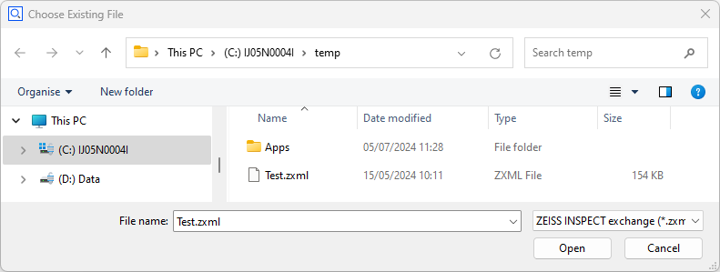

# Selecting a file or folder

> Python scripts for ZEISS INSPECT often require reading or writing files. The command `choose_file()` provides a simple solution for selecting a file path interactively.



## Interactive configuration of `choose_file()`

You insert the command `choose_file()` into your script by using RMB ► Insert ► Choose File... in the script editor. A configuration dialog is shown:


Selection type
: Allows to customize the selection. The following options are available:
  * Select any file
  * Create new file
  * Load existing file
  * Load multiple files
  * Select directory

Base folder (optional)
: The folder shown when the file selection is opened
 
Default file (optional)
: The default file proposed by the dialog
 
File types
: Allows to filter files by file extension pattern
 
After completing the configuration dialog, `choose_file()` is inserted into the source code. You change its configuration by clicking on the command `choose_file()` again.

## Scripting `choose_file()`
 
 Setting the parameters directly in the source code is possible, too:

Parameters:
 
| Name               | Description           | Type         |
| -------------------|-----------------------|--------------|
| file_types         | file types            | QVariantList |      
| file_types_default | default file type     | QString      |      
| folder             | base folder           | QString      |      
| file               | default selected file | QString      |      
| selection_type     | selection type        | QString      |

## Return value

Depending on the selection type, the command `choose_file()` returns

* A single file path,
* A list of file paths,
* Or a folder path.

If the dialog is cancelled, a `RequestError` exception is thrown.

## Example

```{code-block} python
file=gom.script.sys.choose_file_draft (
	file_types=[['*.zxml', 'ZEISS INSPECT exchange'], ['*.gxml', 'ZEISS INSPECT exchange']], 
	file_types_default='*.zxml', 
	file='C:/temp/Test.gxml', 
	folder='C:/temp/', 
	selection_type='load file')

print(f'{file=}')
# Output: file=C:/temp/Test.gxml
```

## See also

A user-defined dialog is used if the file selection must be combined with other widgets or if additional functionality is needed:
* [User-defined dialogs &mdash; File widget`](user_defined_dialogs.md#file-widget)
* [User-defined dialogs &mdash; File system browser widget](user_defined_dialogs.md#file-system-browser-widget)
