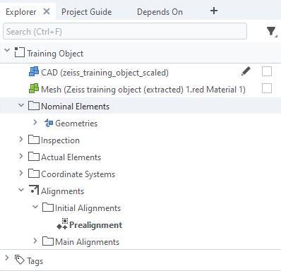
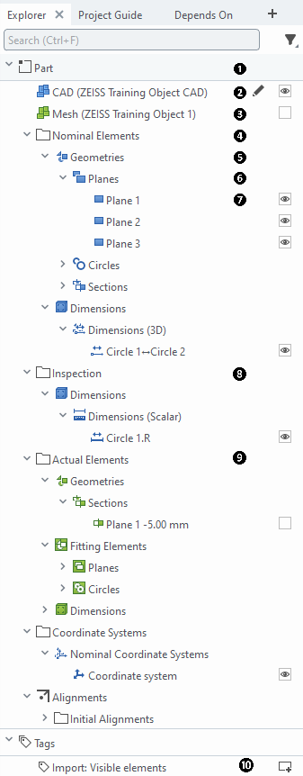
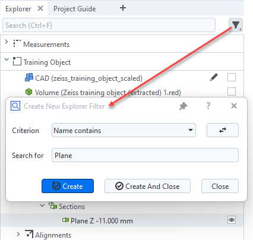
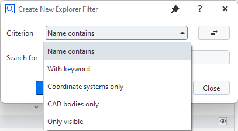

---
myst:
   html_meta:
      "description": "ZEISS INSPECT 2025 App Python API Specification - Selecting Elements"
      "keywords": "Metrology, ZEISS INSPECT, Python API, GOM API, Scripting, Add-ons, Apps, Specification, Documentation"
---

# Selecting elements in scripts

> Selecting elements using `gom.ElementSelection()` has been mentioned in [ZEISS INSPECT Python API Introduction](python_api_introduction.md) briefly. This section describes how `ElementSelection` is used in more details.

```{note}
You are advised to create element selections by script recording, because this is less error-prone than programming the needed command parameters.
```

## Recording element selections

You record an element selection by marking the desired groups of elements in the Explorer and executing a command on
this selection. For convenience, you can use the command `gom.script.cad.show_element()` (shortcut: `v`) and replace it
by the actual command in the script later. You can also select multiple elements at once.



```{code-block} python
gom.script.cad.show_element (
    elements=gom.ElementSelection (
        {'category': [
            'key', 'elements', 'part', gom.app.project.parts['Part'], 'explorer_category', 'nominal'
        ]}
    )
)
```

```{note}
The parameter passed to `ElementSelection` is a dictionary with the key `'category'` and a list as value. The items in this list are essentially key - value pairs.
```

## Accessing elements in a selection

`ElementSelection` is a reference to the selected elements:

```{code-block} Python
elements=gom.ElementSelection (
    {'category': [
        'key', 'elements', 'part', gom.app.project.parts['Part'], 'explorer_category', 'nominal'
    ]}
)
print(elements)
# output: 
# gom.ElementSelection ({'category': ['key', 'elements', 'part', gom.app.project.parts['Part'], 'explorer_category', 'nominal']})
```

To access the selected elements for reading their properties (e.g. element names), you use the returned reference in an
iteration:

```{code-block} Python
for element in elements:
    print(element.name)
# Example output:
# Plane 1
# Plane 2
# Circle 1
```

To get a list of element references, you use:

```{code-block} Python
element_list = list(elements)
print(element_list)
# Example output: 
# [gom.app.project.inspection['Plane 1'], gom.app.project.inspection['Plane 2'], gom.app.project.inspection['Circle 1']]
```  

Using a Python comprehension, you can add another filtering condition:

```{code-block} Python
element_list = [ element for element in elements if element.name.endswith(' 1') ]
# Example output:
# [gom.app.project.inspection['Plane 1'], gom.app.project.inspection['Circle 1']]
```

## Examples

The following Explorer element tree is used to give some `ElementSelection` examples:


```{note}
In the examples below, all selections are restricted to a specific part (part name: `Part`). You can omit the filter specification `'part', gom.app.project.parts['Part']` to get a selection across any part or &mdash; if the project contains multiple parts &mdash; all parts.
```

1. Part

   ```{code-block} Python
   elements=gom.ElementSelection (
       {'category': ['key', 'elements', 'part', gom.app.project.parts['Part']]}
   )
   ```

2. CAD Elements (Nominal part)

   ```{code-block} Python
   elements=gom.ElementSelection (
       {'category': [
           'key', 'elements', 'explorer_category', 'nominal_part'
       ]}
   )
   ```

3. Mesh Elements (Actual part)

   ```{code-block} Python
   elements=gom.ElementSelection (
       {'category': [
           'key', 'elements', 'explorer_category', 'actual_part'
       ]}
   )
   ```

4. Nominal Elements

   ```
   elements=gom.ElementSelection (
       {'category': [
           'key', 'elements', 'part', gom.app.project.parts['Part'], 'explorer_category', 'nominal'
       ]}
   )
   ```

5. Nominal Elements &mdash; Geometries

   ```{code-block} Python
   elements=gom.ElementSelection (
       {'category': [
           'key', 'elements', 'part', gom.app.project.parts['Part'], 'explorer_category', 'nominal',
           'object_family', 'geometrical_element'
       ]}
   )
   ```

6. Nominal Elements &mdash; Geometries &mdash; Planes

   ```{code-block} Python
   elements=gom.ElementSelection (
       {'category': [
           'key', 'elements', 'part', gom.app.project.parts['Part'], 'explorer_category', 'nominal',
           'object_family', 'geometrical_element', 'type', 'inspection_plane'
       ]}
   )
   ```

7. Nominal Elements &mdash; Geometries &mdash; Planes &mdash; Plane 1

   💡 The leaf nodes of the element tree are elements, not element selections!

   ```{code-block} Python
   elements=[gom.app.project.inspection['Plane 1']]
   ```

8. Inspection

   ```{code-block} Python
   elements=gom.ElementSelection (
       {'category': [
           'key', 'elements', 'part', gom.app.project.parts['Part'], 'explorer_category', 'inspection'
       ]}
   )
   ```

9. Actual Elements

   ```{code-block} Python
   elements=gom.ElementSelection (
       {'category': [
           'key', 'elements', 'part', gom.app.project.parts['Part'], 'explorer_category', 'actual'
       ]}
   )
   ```

10. Tags

    ```{code-block} Python
    elements=gom.ElementSelection (
        {'category': ['key', 'elements', 'explorer_category', 'tags']}
    )
    ```

## More element selection options

You can get all inspections directly related to an element with:

```{code-block} Python
elements=gom.ElementSelection (element, {'attachment_group': [None, 'criterias']})
```

You can get an element in the Section View tab with:

```{code-block} Python
element=gom.ElementSelection (element, {'view': 'section_view'})
```

You can get all elements with:

```{code-block} Python
elements=gom.ElementSelection (
    {'category': [
        'key', 'elements', 'overview_explorer_categories', 'all_elements'
    ]}
)
```

You can get all selected elements in a category with:
```{code-block} Python
selected_elements=gom.ElementSelection (
    {'category': [...]},
    filter=['selected']
)
```

```{note}
Unlike the other filter options (see section [Explorer filter](#explorer-filter)), `selected` is only used for script commands and not available in the filter dialog.
```

For the currently selected element, you can also select related elements from various tabs of the Explorer, e.g. "
Relates To", "Depends On" and "Required For":

```{code-block} Python
# Options: related, depends_on, required_for
elements=gom.ElementSelection ({'category': ['key', 'related']})
```

```{hint}
You select elements in the explorer with the command `gom.script.explorer.apply_selection(selection=<elements>)`
```

## Explorer filter

An Explorer Filter restricts the available elements to a certain criterion:





You can add the Explorer Filter interactively, record the resulting command and use the filter parameter in a
subsequent `ElementSelection`:

```{code-block} Python
# Recorded command, can be deleted after copying the filter parameter to the ElementSelection
gom.script.sys.create_explorer_filter (
	filter={'param': 'Circle', 'type': 'by_name'}, 
	uuid='00000000-0000-0000-0000-000000000000'
)

# Nominal elements with 'Circle' in name
elements=gom.ElementSelection (
    {'category': [
        'key', 'elements', 'part', gom.app.project.parts['Part'], 'explorer_category', 'nominal'
    ]},
    filter={'param': 'Circle', 'type': 'by_name'}
)
```

## Syntax

```{code-block}
ElementSelection (
    {'category': [
        'key', 'elements'
        [, 'part', <part_reference>]
        [, 'is_element_in_clipboard', 'True' |
                                      'False'
        ]
        [, 'explorer_category', 'measurements' |
                                'nominal_part' |
                                'actual_part' |
                                'linked_volumes' |
                                'nominal' | 
                                'inspection' | 
                                'actual' | 
                                'coordinate_systems' |
                                'alignment' |
                                'reports' | 
                                'stage_ranges' |
                                'tags' | 
                                ... 
        ]
        [, 'object_family', <object_family_name>]
        [, 'type', <type_name>]
        [, 'overview_explorer_categories', 'all_elements']
    ]}
)

gom.ElementSelection(
    <element>, {'attachment_group': [None, 'criterias']}
)

gom.ElementSelection(
    <element>, {'view': 'section_view'}
)

gom.ElementSelection(
    {'category': ['key', 'related' | 'depends_on' | 'required_for' | ... ]}
)

ElementSelection (
    {'category': [...]},
    filter = {['inverse': True,] 'param': <name>, 'type': 'by_name' } |
             {['inverse': True,] 'param': <keyword>, 'type': 'by_keyword' } |
             'visible' |
             'bodies' |
             'coordinate_systems' |
             {'inverse': True, 'type': 'visible' | 'bodies' | 'coordinate_systems'} |
             'selected'
)
```

You can also use the `ElementSelection` command with multiple selection filters to get elements
that match any of the filters (disjunction / OR):

```{code-block} Python
elements=gom.ElementSelection (
    {'category': ['key', 'elements', 'explorer_category', 'nominal']},
    {'category': ['key', 'elements', 'explorer_category', 'actual']}
)
```
