# User-defined Dialogs

- [Creating dialogs](#creating-dialogs)
- [Dialog widgets](#dialog-widgets)
- [Executing dialogs](#executing-dialogs)
- [Wizards](#wizards)

## Creating dialogs

- [Dialog designer](#dialog-designer)
- [Dialog layout](#dialog-layout)
    - [Editing the grid](#editing-the-grid)
    - [Spacers](#spacers)
- [Widgets](#widgets)
    - [Inserting and removing widgets](#inserting-and-removing-widgets)
    - [Configuring widgets](#configuring-widgets)
- [Editing already created dialogs](#editing-already-created-dialogs)

### Dialog designer

* User defined **Dialogs** can be inserted into the script using _right mouse button_ → Insert → Dialog... in the <a href="../using_add_on_editor/using_add_on_editor.html">App Editor</a>.

    

* When a new dialog is inserted, a dialog **Template**, the **target location** of the dialog configuration and the dialog **Type** can be selected.

    

* Some dialog **Templates** are provided by the system. Additional templates can be created by the user.

* The options for placing a dialog configuration (see section **Create as** in the window above) are
    * **Separate dialog file** - default
    * **Embedded into script**

    The base filename of a dialog file is `dialog.gdlg`, it can be renamed later. A dialog is stored as a JSON document internally.

    ```{code-block} python
    :caption: Example&colon; Script with separate dialog file

    RESULT=gom.script.sys.execute_user_defined_dialog (file=':dialog.gdlg')
    ```

    ```{code-block} python
    :caption: Example&colon; Script with embedded dialog

    RESULT=gom.script.sys.execute_user_defined_dialog (dialog={
        "content": [
            [
                {
                    ...
                }
            ]
        ],    
        "control": {
            "id": "OkCancel"
        },
        "embedding": "always_toplevel",
        "position": "automatic",
        "size": {
            "height": 155,    
            "width": 198
        },
        "sizemode": "automatic",
        "style": "",
        "title": {
            "id": "",
            "text": "Message",
            "translatable":     True
        }
    })
    ```

* The options for the dialog **Type** are
    * **Break dialog (script is blocked)** - default
    * **Extendable break dialog (script is blocked)**
    * **Info dialog (script continues)** 
    
    The dialog type is explained in section [Executing dialogs](#executing-dialogs)


* Dialogs are designed using the GUI based **Dialog Editor**.

    
    
```{note}
The Dialog Editor is opened from the <a href="../using_app_editor/using_app_editor.html">App Editor</a> by
* Selecting a dialog file (*.gdlg) in the App Explorer
* Selecting a dialog definition embedded in a Python script
* Using _right mouse button_ → Insert → Dialog... in the script editor
```

### Dialog layout

* The **Dialog Editor** is using a grid based layout.
* Elements can be inserted into the grid via drag and drop.

#### Editing the grid

💡 Editing the layout means changing the underlying grid.

* Because the underlying layout is a grid, the following actions are possible:
    * Adding and removing rows and columns.
    * Merging and splitting rows and columns.

    | Tool button                              | Function                          |
    | ---------------------------------------- | --------------------------------- |
    |    | Split selected cells vertically   |
    |  | Split selected cells horizontally |
    |               | Merge selected cells              |

* Selected cells are marked with a red overlay.

    

#### Spacers

💡 **Spacers** are empty spaces extending in either horizontal or vertical direction.

* If a spacer is inserted into a cell, the cell claims the maximum available space in spacer direction.
* All other cells share the remaining space.


### Widgets

#### Inserting and removing widgets

* The list of available widgets resides at the left of the Dialog Editor in the section **Dialog Elements**.
* **Widgets** are inserted via drag and drop.
* Newly dropped widgets overwrite existing widgets at the drop target cells.
* A unique **object name** is assigned during insertion of a widget. This name is used to access the widget in the Python script.
* Because each cell has to be filled with a widget, widgets can not be removed from the grid. To get rid of a widget
    * Another widget can be dragged and dropped onto the existing widget or
    * The widget cell can be merged with another cell.

💡 Removing widgets from the grid is not possible. Instead, they can be overwritten by other widgets.


#### Configuring widgets

* The properties of selected widgets can be edited in the **Property Editor** at the right side of the Dialog Editor.
* Every widget has at least a unique **Object name**.
* Additionally, various parameters depending on the widget type can be edited.


The definition of the dialog can be found in [scriptingEditorExampleDialog.py](assets/scriptingEditorExampleDialog.py)

### Editing already created dialogs

* Creating a dialog leads to a script command with a dialog representation as JSON code, which can either be embedded or stored in an external dialog file (`*.gdlg`).
* Double clicking onto the embedded dialog or the dialog file opens the Dialog Editor again.

## Dialog widgets

- [Use of the \_\_doc\_\_ string](#use-of-the-__doc__-string)
- [Control widget](#control-widget)
    - [Control widget elements](#control-widget-elements)
    - [Control button properties](#control-button-properties)
    - [Status label](#status-label)
- [Specific widgets](#specific-widgets)
    - [Description field (label) widget](#description-field-label-widget)
    - [Continuous text widget](#continuous-text-widget)
    - [Image widget](#image-widget)
    - [Log widget](#log-widget)
    - [Progress-bar widget](#progress-bar-widget)
    - [Element name widget](#element-name-widget)
    - [Integer widget](#integer-widget)
    - [Decimal widget](#decimal-widget)
    - [Text entry field](#text-entry-field)
    - [Slider widget](#slider-widget)
    - [Checkbox widget](#checkbox-widget)
    - [File widget](#file-widget)
    - [Date widget](#date-widget)
    - [Color widget](#color-widget)
    - [Unit widget](#unit-widget)
    - [Selection element widget](#selection-element-widget)
    - [Selection list widget](#selection-list-widget)
    - [Button widget](#button-widget)
    - [Radio button widget](#radio-button-widget)
    - [Abort button widget](#abort-button-widget)
    - [Tolerances widget](#tolerances-widget)
    - [File system browser widget](#file-system-browser-widget)

This section gives an overview of the available widgets. If the code examples given in this section are not intuitive to you, you might want to take a look 
into [Executing dialogs](#executing-dialogs).

### Use of the \_\_doc\_\_ string

Information about the widgets can be obtained by accessing their doc string. Let `objName` be the object name of a widget and `DIALOG` the dialog handle 
(see [Executing dialogs](#executing-dialogs) if this is unclear to you), the `__doc__` string can be obtained as follows:

```python
print( DIALOG.objName.__doc__ )
```

### Control widget

💡 The **Control** widget contains the **ok** / **cancel** or similar buttons of the dialog.

* The control elements of a dialog cannot be configured like other dialog widgets.
* Therefore, their name is fixed and they are grouped together inside of the control widget named **control**.
* The control elements consist of the dialogs lower buttons plus a configurable dialog status label.

| Handle                    | Property                                  | Example                                             |
| ------------------------- | ----------------------------------------- | --------------------------------------------------- |
| DIALOG.control            | Control widget                            | -                                                   |
| DIALOG.control.status     | Status icon of the control widget         | <pre>DIALOG.control.status = 'Point 1 missing'</pre> |
| DIALOG.control.\<button\> | Handle for a button of the control widget | <pre>DIALOG.control.ok.enabled = False</pre>        |

#### Control widget elements

💡 The names of the **Control** widget elements are fixed

* Usually, the names are corresponding with the elements' semantics. For example, the name of the **ok** button is 'ok'. The names can also be obtained from the `__doc__` string as shown in the code example below.
* The control elements are accessed like all other widget attributes.

```{code-block} python
:caption: Accessing the control widget

# Print control widget properties<br>print (DIALOG.control.__doc__)
ControlGroup

Attributes:

status (string)              - Status tool tip icon
ok     (unspecified/various) - Control widget
cancel (unspecified/various) - Control widget
```

#### Control button properties

Control buttons only have the following two properties which can be set programmatically:

| Property | Type | Example                                          |
| -------- | ---- | ------------------------------------------------ |
| text     | str  | <pre>DIALOG.control.prev.text = 'Previous'</pre> |
| enabled  | bool | <pre>DIALOG.control.ok.enabled = False</pre>     |

#### Status label

⚠️ The **Status label** of the control widget is invisible until a status text is set.

* If a status text is set, a small warning icon appears, like in regular applications' dialogs.
* The status label can be configured using its properties like all other widgets.


```{code-block} python
:caption: Using the Status label

DIALOG=gom.script.sys.create_user_defined_dialog (content='dialog definition')

# Set status label text
DIALOG.control.status = 'No point selected.'

# Set 'ok' button to disabled<br>DIALOG.control.ok.enabled = False
gom.script.sys.show_user_defined_dialog(dialog = DIALOG)

```

You can reset the status icon and clear the error message by assigning an empty string (`DIALOG.control.status = ''`).

### Specific widgets

#### Description field (label) widget


Description field (label) widget
: The Description field (label) widget allows to display static text. It is typically used for labelling a section or an individual element of a dialog.

| Property  | Type  | Example                                                                               |
| --------- | ----- | ------------------------------------------------------------------------------------- |
| tooltip   | str   | <pre>DIALOG.label.tooltip = 'This is just a label!'</pre>                             |
| enabled   | bool  | <pre>DIALOG.label.enabled = False</pre>                                               |
| focus     | bool  | <pre>DIALOG.label.focus = True</pre>⚠️ Only works if dialog is open                   |
| visible   | bool  | <pre>DIALOG.label.visible = False</pre>                                               |
| text      | str   | <pre>DIALOG.label.text = 'New label:'</pre>                                           |
| word_wrap | bool  | <pre>DIALOG.label.word_wrap = True</pre>                                              |

 
#### Continuous text widget


Continuous text widget
: The Continuous text widget allows to display static text and keywords. A double click onto a text field widget opens the content editor. Some formatting can be applied.

| Editor                     | Dialog                      |
| -------------------------- | --------------------------- |
|   |  |


% * The keywords displayed in text field widgets can originate from different source:
%
%     * Global application keywords
%
%     * project related keywords
%
%     * local script variables.
%
% ⚠️ Local script variables can be displayed in text fields by inserting them via the 'insert expression' dialog.
%
%  * Local script variables are invalid until the variable assignment is reached. They cannot be displayed statically in the text
%  field editor prior to script execution, so an invalid value will most certainly be displayed instead.
% 
% To Do: Check how to insert local variables

| Property            | Type | Example                                                    |
| ------------------- | ---- | ---------------------------------------------------------- |
| enabled             | bool | <pre>DIALOG.textWidget.enabled = False</pre>               |
| text                | str  | <pre>print(DIALOG.textWidget.text)</pre>                   |
| wordwrap            | bool | <pre>DIALOG.textWidget.wordwrap = True</pre>               |
| visible             | bool | <pre>DIALOG.textWidget.visible = False</pre>               |                              
| default_font_family | str  | <pre>DIALOG.textWidget.default_font_family = 'Arial Black'</pre> |                      
| default_font_size   | int  | <pre>DIALOG.textWidget.default_font_size = 12</pre>        |

##### Displaying keywords in a continuous text widget

A keyword can be inserted into the text with the following procedure:

1. RMB -> 'Insert Expression...'

    

2. Select 'Insert Keyword' button

    

3. Select the desired keyword from the tree

    

4. The keyword and its actual value are shown

    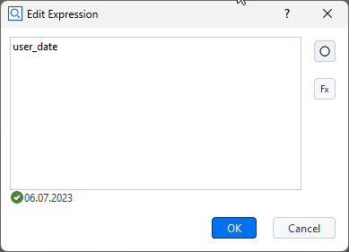

5. The final rendering of the text widget

    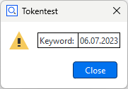

##### Internal representation of a dialog with text widget

The dialog is stored as a JSON document internally.


```{code-block} python
:caption: Internal representation of a dialog

gom.script.sys.execute_user_defined_dialog (dialog={
	"content": [
		[
			{
                ...
			},
			{
				"columns": 1,
				"default_font_family": "",
				"default_font_size": 0,
				"name": "text",
				"rows": 1,
				"text": {
					"id": "",
					"text": "\<html\>\<p align=\"center\"\>By clicking 'Close', the dialog will be closed.\</p\>\</html\>",
					"translatable": True
				},
                                ...
				"type": "display::text",
				"wordwrap": False
			}
		]
	],
	"control": {
		"id": "Close"
	},
        ...
})
```

#### Image widget


Image widget
: The Image widget allows to display arbitrary images.


| Property           | Type      | Example                                                      |
| ------------------ | --------- | ------------------------------------------------------------ |
| enabled            | bool      | <pre>DIALOG.image.enabled = False</pre>                      |
| use_system_image   | bool      | <pre>DIALOG.image.use_system_image = True</pre>              |
| system_image       | str       | <pre># Possible values: 'system_message_information', 'system_message_warning',<br> 'system_message_critical', 'system_message_question'<br>DIALOG.image.system_image = 'system_message_question'</pre> |
| file_name          | str       | read-only!                                                   |
| keep_original_size | bool      | read-only!                                                   |
| keep_aspect        | bool      | read-only!                                                   |
| data               | (special) | <pre># This is the actual image data<br># Copy image from one dialog to another:<br>my_dialog.my_image.data = image_container_dialog.image_1.data</pre> |
| width              | int       | <pre>print('image width ' + str(DIALOG.image.width))</pre>   |
| height             | int       | <pre>print('image height ' + str(DIALOG.image.height))</pre> |
| visible            | bool      | <pre>DIALOG.image.visible = False</pre>              |

Note that you can switch from a system image to a user image using the property `use_system_image`. But this user image must have been selected beforehand in the designer. You cannot read a new image file by setting the `filename` property. Also, all of the image formatting properties (`keep_original_size`, `keep_aspect`, `width`, `height`) only work in the designer. From the script you can only read these values. Although you cannot read images using the `filename` property you can copy images from one dialog to another using the `data` property. So you are able to prepare (create) a dialog as an image container holding several images. You can then use this image container dialog to copy the image you need to an actually displayed dialog.

##### Internal representation of a dialog with image widget

The dialog is stored as a JSON document internally. The 'data' element contains the image data.

```{code-block} python
:caption: Internal representation of an image

# The 'data' element contains the image data (shortened version here)
RESULT=gom.script.sys.execute_user_defined_dialog (dialog={
    "content": [
        [
            {
                "columns": 1,
                "data": "AAAAAYlQTkcNChoKAAAADUlIRFIAAAQAAAACQAgCAAAAnPeDgptZSsdt...",
                "file_name": "C:/Users/IQMPRINK/Downloads/zeiss-inspect_python.jpg",
                "height": 144,
                "keep_aspect": True,
                "keep_original_size": False,
                "name": "image",
                "rows": 1,
                "system_image": "system_message_information",
                "tooltip": {
                    "id": "",
                    "text": "",
                    "translatable": True
                },
                "type": "image",
                "use_system_image": False,
                "width": 256
            }
        ]
    ],
    "control": {
        "id": "Close"
    },
    "embedding": "always_toplevel",
    "position": "automatic",
    "size": {
        "height": 233,
        "width": 292
    },
    "sizemode": "automatic",
    "style": "",
    "title": {
        "id": "",
        "text": "Dialog with image",
        "translatable": True
    }
})
```

#### Log widget


Log widget
: The Log widget can display multiple lines of unformatted text, which can be easily saved to a text file by clicking the save button.


| Property             | Type      | Example                                                        |
| -------------------- | --------- | -------------------------------------------------------------- |
| enabled              | bool      | <pre>DIALOG.log.enabled = True</pre>                           |
| text                 | str       | <pre>DIALOG.log.text += 'Yet another log message.\n</pre>      |
| word_wrap            | bool      | <pre>DIALOG.log.word_wrap = True</pre>                         |
| show_save            | bool      | <pre>DIALOG.log.show_save = False</pre>                        |
| save_dialog_title    | str       | <pre>DIALOG.log.save_dialog_title = 'Save operator log'</pre>  |
| scroll_automatically | bool      | <pre>DIALOG.log.scroll_automatically = True</pre>              |
| visible              | bool      | <pre>DIALOG.log.visible = False</pre>                          |
| monospace            | bool      | <pre># Use monospace font<br>DIALOG.log.monospace = True</pre> |

#### Progress bar widget

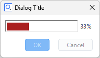

Progress bar widget
: The Progress bar widget can be used in the two modes _system_ and _manual_.

Manual mode
: In this mode, the user may set the progress bar through its `value` variable.

    ```{code-block} python
    import gom, time
    DIALOG=gom.script.sys.create_user_defined_dialog (content='dialog definition')
    DIALOG.progress.minimum = 0
    DIALOG.progress.maximum = 100
    gom.script.sys.open_user_defined_dialog( dialog = DIALOG )
    DIALOG.progress.value = 0
    time.sleep(1)
    DIALOG.progress.value = 33
    time.sleep(1)
    DIALOG.progress.value = 66
    time.sleep(1)
    DIALOG.progress.value = 100
    gom.script.sys.close_user_defined_dialog (dialog=DIALOG)
    ```

Automatic mode
: In this mode, the progress bar displays the same progress informations as the progress bar in the lower right corner of the software.

    ```{code-block} python
    import gom
    DIALOG=gom.script.sys.create_user_defined_dialog (content='dialog definition')
    gom.script.sys.open_user_defined_dialog (dialog=DIALOG)
    gom.script.sys.create_project ()
    gom.script.sys.import_project (file='some project')
    gom.script.sys.close_user_defined_dialog (dialog=DIALOG)
    ```

You can switch between automatic and manual mode from within the script by setting the mode variable as shown below:

```python
# manual mode:
DIALOG.progress.mode = "manual"

# automatic mode:
DIALOG.progress.mode = "system"
```

Partially controlled system progress bar
: The range of a system progress bar can be divided into parts, sequentially controlled by an executed command.
  * The progress bar range can be split into multiple parts.
  * Each part controls an equally sized progress bar interval. If, for example, there are 3 parts, the first part ranges from 0 to 33, the second from 33 to 66 and the third from 66 to 100.
  * When a command is executed, the command controls just the one active part of the progress bar widget.

  

  ``` python
  # -*- coding: utf-8 -*-

  import gom

  # Create a user defined dialog with a progress bar, mode 'system'
  DIALOG=gom.script.sys.create_user_defined_dialog (content='dialog definition')
  gom.script.sys.open_user_defined_dialog( dialog = DIALOG )

  # Split progress bar into 3 parts
  DIALOG.progress.parts = 3

  # Current part is the first interval (part '0', because we are counting from '0')
  DIALOG.progress.step = 0

  # Execute load command. The command will control the first progress bar range from 0% to 33%.
  # That means when the command has been finished, the progress bar will display '33%'.
  gom.script.sys.load_project (file='some project')

  # Current part is the second interval. The progress bar runs from 33% to 66%
  DIALOG.progress.step = 1

  gom.script.sys.switch_to_report_workspace ()
  gom.script.report.update_report_page (
  pages=gom.app.project.reports,
  switch_alignment=True,
  switch_stage=False)

  # Current part is the third interval. The progress bar runs from 66% to 100%
  DIALOG.progress.step = 2

  gom.script.sys.switch_to_inspection_workspace ()
  gom.script.sys.recalculate_all_elements ()
  ```

💡 It is possible to switch  between automatic and manual mode for each part.

| Property | Type  | Example                                                                                 |
| -------- | ----- | --------------------------------------------------------------------------------------- |
| tooltip  | str   | <pre>DIALOG.progressbar.tooltip = 'Work in progress!'</pre>                             |
| enabled  | bool  | <pre>DIALOG.progressbar.enabled = False</pre>                                           |
| value    | int   | <pre>if DIALOG.progressbar.value < 50:</pre>                                            |
| focus    | bool  | <pre>DIALOG.progressbar.focus = True</pre>⚠️ Only works if dialog is open              |
| minimum  | int   | <pre>DIALOG.progressbar.minimum = 20</pre>                                              |
| maximum  | int   | <pre>DIALOG.progressbar.maximum = 50</pre>                                              |
| visible  | bool  | <pre>DIALOG.progressbar.visible = False</pre>                                           |
| parts    | int   | <pre># Set number of progress bar parts<br>DIALOG.progressbar.parts = 3</pre>           |
| step     | int   | <pre># Set current step<br>DIALOG.progressbar.step = 0</pre>                            |
| text     | str   | <pre># Set text mode (none, percentage, step)<br>DIALOG.progressbar.text = 'step'</pre> |
| mode     | str   | <pre># Set mode (system, manual)<br>DIALOG.progressbar.mode = 'manual'</pre>            |

#### Element name widget


Element name widget
: The Element name widget is used to request an element name from the user. It is possible to select the default name (according to naming scheme, e.g. 'Point 2' if 'Point 1' already exists), or to enter an arbitrary name. `elementnameWidget` is the object name of the element name widget in the example below.

```python
# Let the user define 3 new points (the coordinates are created automatically in this example)
for i in range(3):
    DIALOG=gom.script.sys.create_user_defined_dialog (dialog='dialog definition')
    
    #
    # Event handler function called if anything happens inside of the dialog
    #
    def dialog_event_handler (widget):
        pass
    
    DIALOG.handler = dialog_event_handler
    
    RESULT=gom.script.sys.show_user_defined_dialog (dialog=DIALOG)
    
    print (RESULT.elementnameWidget)
    
    MCAD_ELEMENT=gom.script.primitive.create_point (
        name=RESULT.elementnameWidget,
        point={'point': gom.Vec3d (i+10.0, 0.0, 0.0)}
    )
```

| Property | Type  | Example                                                                               |
| -------- | ----- | ------------------------------------------------------------------------------------- |
| tooltip  | str   | <pre>DIALOG.inputEleName.tooltip = 'Enter the number of points!'</pre>                |
| enabled  | bool  | <pre>DIALOG.inputEleName.enabled = False</pre>                                        |
| value    | int   | <pre>DIALOG.inputEleName.value = 'Blob'</pre>                                         |
| focus    | bool  | <pre>DIALOG.inputEleName.focus = True</pre>⚠️ Only works if dialog is open           |
| visible  | bool  | <pre>DIALOG.inputEleName.visible = False</pre>                                        |
| basename | str   | <pre>DIALOG.inputEleName.basename = 'Point'</pre>                                     |
| mode     | str   | <pre># Mode to get the name suggestion from. ('manually', 'from_element_type', 'check_like')<br>DIALOG.inputEleName.mode = 'from_element_type'</pre> |
| read_only | bool | <pre># Keep user from changing the default<br>DIALOG.inputEleName.read_only = true</pre> |

#### Integer widget


Integer widget
: The Integer widget is used to request an integer value from the user. `integerWidget` is the object name of the integer widget in the example below.

``` python
RESULT=gom.script.sys.execute_user_defined_dialog (content='dialog definition')
userInput = RESULT.integerWidget
```

| Property | Type   | Example                                                                |
| -------- | ------ | ---------------------------------------------------------------------- |
| tooltip  | str    | <pre>DIALOG.inputInt.tooltip = 'Enter the number of points!'</pre>     |
| enabled  | bool   | <pre>DIALOG.inputInt.enabled = False</pre>                             |
| value    | int    | <pre>if DIALOG.inputInt.value < 15:</pre>                              |
| focus    | bool   | <pre>DIALOG.inputInt.focus = True</pre>⚠️ Only works if dialog is open |
| visible  | bool   | <pre>DIALOG.inputInt.visible = False</pre>                             |
| minimum  | double | <pre>DIALOG.inputInt.minimum = 20</pre>                                |
| maximum  | double | <pre>DIALOG.inputInt.maximum = 50</pre>                                |

#### Decimal widget


Decimal widget
: The Decimal widget is used to request a floating point value from the user. It is possible to choose the number of digits and a unit. The selectable units are the ones from the user preferences (Edit \> Application \> Settings \> Preferences) in the _Default units_ tab. `decimalWidget` is the object name of the decimal widget in the example below.

``` python
RESULT=gom.script.sys.execute_user_defined_dialog (content='dialog definition')
userInput = RESULT.decimalWidget
```

| Property  | Type   | Example                                                                  |
| --------- | ------ | ------------------------------------------------------------------------ |
| tooltip   | str    | <pre>DIALOG.input.tooltip = 'Enter distance between points!'</pre>       |
| enabled   | bool   | <pre>DIALOG.input.enabled = False</pre>                                  |
| value     | int    | <pre>if DIALOG.input.value < 15:</pre>                                   |
| focus     | bool   | <pre>DIALOG.input.focus = True</pre>⚠️ Only works if dialog is open     |
| visible   | bool   | <pre>DIALOG.input.visible = False</pre>                                  |
| minimum   | double | <pre>DIALOG.input.minimum = 20</pre>                                     |
| maximum   | double | <pre>DIALOG.input.maximum = 50</pre>                                     |
| precision | double | <pre># Set precision to 2 decimals<br>DIALOG.input.precision = 2</pre>   |
| unit      | str    | <pre># Set unit ID<br>DIALOG.input.unit = 'LENGTH'</pre>                 |

% No visible effect:
% background_style - str - Set style sheet based background color  - red, green, blue 

#### Text entry field


Text entry field
: The Text entry field widget can be used to get string input from the user. A simple use case is given by the next code block. `textEntryWidget` is the object name of the widget in the example below.

``` python
DIALOG=gom.script.sys.create_user_defined_dialog (content='dialog definition')
DIALOG.textEntryWidget = "some default text"
RESULT = gom.script.sys.show_user_defined_dialog(dialog = DIALOG)
print( RESULT.textEntryWidget ) # the user input string
```

| Property  | Type  | Example                                                                    |
| --------- | ----- | -------------------------------------------------------------------------- |
| tooltip   | str   | <pre>DIALOG.inputString.tooltip = 'Enter object description'</pre>         |
| enabled   | bool  | <pre>DIALOG.inputString.enabled = True</pre>                               |
| value     | str   | <pre>DIALOG.inputString.value = "Warsaw"</pre>                             |
| focus     | bool  | <pre>DIALOG.inputString.focus = True</pre>⚠️ Only works if dialog is open |
| visible   | bool  | <pre>DIALOG.inputString.visible = False</pre>                              |
| read_only | bool  | <pre>if DIALOG.inputString.read_only:</pre>                                |
| password  | bool  | <pre># Hide user input by replacing each character by a dot<br>DIALOG.inputString.password = True</pre> |

#### Slider widget


Slider widget
: The Slider widget can be used to get a float value from a certain interval from the user. `sliderWidget` is the object name of the slider widget in the example below.

``` python
DIALOG=gom.script.sys.create_user_defined_dialog (content='dialog definition')

RESULT = gom.script.sys.show_user_defined_dialog (dialog=DIALOG)
print( RESULT.sliderWidget ) # some text
```

| Property      | Type   | Example                                                                    |
| ------------- | ------ | -------------------------------------------------------------------------- |
| tooltip       | str    | <pre>DIALOG.input.tooltip = 'Drag slider to change rotation'</pre>         |
| enabled       | bool   | <pre>DIALOG.input.enabled = True</pre>                                     |
| value         | str    | <pre>print('Angle:', str(DIALOG.input.value))</pre>                        |
| focus         | bool   | <pre>DIALOG.input.focus = True</pre>⚠️ Only works if dialog is open        |
| visible       | bool   | <pre>DIALOG.input.visible = False</pre>                                    |
| minimum       | double | <pre>DIALOG.input.minimum = -90</pre>                                      |
| maximum       | double | <pre>DIALOG.input.maximum = 90</pre>                                       |
| precision     | double | <pre># Set precision to 1 decimal<br>DIALOG.input.precision = 1</pre>      |
| step          | double | <pre># Set step size to 15<br>DIALOG.input.step = 15</pre>                 |
| orientation   | str    | <pre>print(DIALOG.input.orientation)</pre>⚠️ read-only                     |

% ticks are not drawn
% tick_interval - double - Interval of ticks drawn


#### Checkbox widget


Checkbox widget
: The Checkbox widget can be used to get boolean input from the user. `checkboxWidget` is the object name of the checkbox widget in the example below.

``` python
DIALOG=gom.script.sys.create_user_defined_dialog (content='dialog definition')

RESULT=gom.script.sys.show_user_defined_dialog (dialog=DIALOG)
print (RESULT.checkboxWidget)
```

| Property  | Type  | Example                                                                                              |
| --------- | ----- | ---------------------------------------------------------------------------------------------------- |
| tooltip   | str   | <pre>DIALOG.inputCheckbox.tooltip = 'Check this option to clear the results after evaluation.'</pre> |
| enabled   | bool  | <pre>DIALOG.inputCheckbox.enabled = True</pre>                                                       |
| value     | bool  | <pre>print('Evaluation enabled:', str(DIALOG.inputCheckbox.value))</pre>                             |
| title     | str   | <pre>DIALOG.inputCheckbox.title = 'Mirror option'</pre>                                              |
| visible   | bool  | <pre>DIALOG.inputCheckbox.visible = False</pre>                                                      |

#### File widget

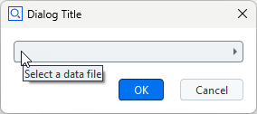

File widget
: By clicking the File widget, a file selection dialog is opened. This allows to select a file from the file system.


| Property  | Type  | Example                                                                                              |
| --------- | ----- | ---------------------------------------------------------------------------------------------------- |
| tooltip   | str   | <pre>DIALOG.inputFile.tooltip = 'Select a file for the protocol'</pre>                               |
| enabled   | bool  | <pre>DIALOG.inputFile.enabled = False</pre>                                                          |
| value     | str   | <pre>if DIALOG.inputFile.value != '':</pre>                                                          |
| focus     | bool  | <pre>DIALOG.inputFile.focus = True</pre>⚠️ Only works if dialog is open                             |
| visible   | bool  | <pre>DIALOG.inputFile.visible = False</pre>                                                          |
| type      | str   | <pre># Possible values: 'any' (any file), 'new' (not an existing file),<br># 'file' (an existing file), 'multi_file' (multiple existing files),<br># 'directory' (an existing folder)<br>DIALOG.inputFile.type = 'any'</pre> |
| title     | str   | <pre>DIALOG.inputFile.title = 'Select the location for the protocol files'</pre>                     |
| default   | str   | <pre>DIALOG.inputFile.default = 'D:/data/default.txt'</pre>                                          |
| file      | str   | <pre>print(DIALOG.inputFile.file)</pre>                                                              |
| file_types | list | <pre># Show only specified file types; each list item must consist of \[\<filename_extension\>, \<description\>\]<br>DIALOG.inputFile.file_types = \[\['*.g3d', 'Mesh data'\], \['*.stp', 'CAD data'\]\]</pre> ⚠️ ``limited`` must be set to ``True`` in order to apply the filter! |
| limited    | bool | <pre># Limit file selection to 'file_types'<br>DIALOG.inputFile.limited = True</pre>                 |

% Clarify this:
% selection_type - str - File selector type; any, directory, executable, file, multi_file

#### Date widget


Date widget
: The Date widget requests a date from the user. `dateWidget` is the object name of the date widget in the example below.

``` python
DIALOG=gom.script.sys.create_user_defined_dialog (content='dialog definition')
dateObject = DIALOG.dateWidget.value # date object
print( DIALOG.dateWidget.year )  # integer
print( DIALOG.dateWidget.month ) # integer
print( DIALOG.dateWidget.day )   # integer
```

| Property          | Type      | Example                                                                                              |
| ----------------- | --------- | ---------------------------------------------------------------------------------------------------- |
| tooltip           | str       | <pre>DIALOG.inputDate.tooltip = 'Enter fabrication date'</pre>                                       |
| enabled           | bool      | <pre>DIALOG.inputDate.enabled = False</pre>                                                          |
| value             | (special) | <pre>print('Selected date:', str(DIALOG.inputDate.value))</pre>                                      |
| focus             | bool      | <pre>DIALOG.inputDate.focus = True</pre>⚠️ Only works if dialog is open                              |
| visible           | bool      | <pre>DIALOG.inputDate.visible = False</pre>                                                         |
| use_current_date  | bool      | <pre>DIALOG.inputDate.use_current_date = True</pre>💡 if set, use current date to initialize widget. |
| year              | int       | <pre>DIALOG.inputDate.year = 2014</pre>                                                              |
| month             | int       | <pre>DIALOG.inputDate.month = 12</pre>                                                               |
| day               | int       | <pre>DIALOG.inputDate.day = 24</pre>                                                                 |
| show_today_button | bool      | <pre>DIALOG.inputDate.show_today_button = True</pre>                                                 |


#### Color widget


Color widget
: The Color widget allows to select a color. `colorWidget` is the object name of the color widget in the example below. `gomColor` behaves in the same way as `gom.Color( ... )`.

``` python
DIALOG=gom.script.sys.create_user_defined_dialog (content='dialog definition')

#
# Event handler function called if anything happens inside of the dialog
#
def dialog_event_handler (widget):
    if widget == DIALOG.colorWidget:
        gomColor = DIALOG.colorWidget.color
        print( gomColor) # output: gom.Color (#ffffffff)

DIALOG.handler = dialog_event_handler

RESULT=gom.script.sys.show_user_defined_dialog (dialog=DIALOG)
print('Selection:', RESULT.colorWidget) # example output (white): 0xffffffff
```

| Property             | Type      | Example                                                                                              |
| -------------------- | --------- | ---------------------------------------------------------------------------------------------------- |
| tooltip              | str       | <pre>DIALOG.inputColor.tooltip = 'Select a color for the marks.'</pre>                               |
| enabled              | bool      | <pre>DIALOG.inputColor.enabled = True</pre>                                                          |
| value                | (special) | <pre>print('Mark color:', str(DIALOG.inputColor.value))</pre>                                        |
| focus                | bool      | <pre>DIALOG.inputColor.focus = True</pre>⚠️ Only works if dialog is open                            |
| visible              | bool      | <pre>DIALOG.inputColor.visible = False</pre>                                                         |
| transparency_allowed | bool      | <pre>DIALOG.inputColor.transparency_allowed = True</pre>                                             |

#### Unit widget


Unit widget
: The Unit widget allows to select a unit. `unitWidget` is the object name of the color widget in the example below.

``` python
DIALOG=gom.script.sys.create_user_defined_dialog (content='dialog definition')

#
# Event handler function called if anything happens inside of the dialog
#
def dialog_event_handler (widget):
    if widget == DIALOG.unitWidget:
        unit = DIALOG.unitWidget.value
        print( unit) # ANGLE

DIALOG.handler = dialog_event_handler

RESULT=gom.script.sys.show_user_defined_dialog (dialog=DIALOG)
```

| Property             | Type      | Example                                                                                              |
| -------------------- | --------- | ---------------------------------------------------------------------------------------------------- |
| tooltip              | str       | <pre>DIALOG.inputUnit.tooltip = 'Select a unit.'</pre>          |
| enabled              | bool      | <pre>DIALOG.inputUnit.enabled = True</pre>                                                           |
| value                | (special) | <pre>print('Unit ID:', DIALOG.inputUnit.value)</pre>                                         |
| focus                | bool      | <pre>DIALOG.inputUnit.focus = True</pre>⚠️ Only works if dialog is open                             |
| visible              | bool      | <pre>DIALOG.inputUnit.visible = False</pre>                                                          |

#### Selection element widget

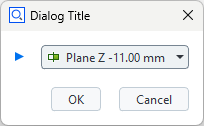

Selection element widget
: The Selection element widget can be used to select the elements from the element explorer. The following element types can be chosen:
  * Any Point
  * Point element
  * Line element
  * Plane element
  * Direction
  * User-defined

`elementSelectionWidget` is the object name of the element selection widget in the example below.

``` python
DIALOG=gom.script.sys.execute_user_defined_dialog (content='dialog definition')

selectedElement = DIALOG.elementSelectionWidget
print(selectedElement.value ) # output: gom.app.project.inspection['Equidistant Surface Points 1']
```

| Property | Type      | Example                                                                                              |
| -------- | --------- | ---------------------------------------------------------------------------------------------------- |
| tooltip  | str       | <pre>DIALOG.selectElement.tooltip = 'Select a line for rotation'</pre>                               |
| enabled  | bool      | <pre>DIALOG.selectElement.enabled = False</pre>                                                      |
| value    |(special)  | <pre>if DIALOG.selectElement.value != None:</pre>                                                    |
| focus    | bool      | <pre>DIALOG.selectElement.focus = True</pre>⚠️ Only works if dialog is open                          |
| visible  | bool      | <pre>DIALOG.selectElement.visible = False</pre>                                                      |
| supplier | str       | <pre># Read-only property<br># Possible values: 'any', 'points', 'lines', 'planes', 'directions', 'custom'<br>print(DIALOG.selectElement.supplier)</pre> |
| filter   | function  | Element filter function for the 'custom' supplier. See example below.                                |

The following script shows how to use a custom filter for element selection. The example filter allows the user to select a system plane:

``` python
DIALOG4=gom.script.sys.create_user_defined_dialog (content='...')


def dialog_event_handler (widget):
    pass

# filter system planes
def element_filter( element ):
    try:
        if element.type == 'plane':
            return True
    except Exception as e:
        pass
    return False

DIALOG4.handler = dialog_event_handler
DIALOG4.input_new.filter = element_filter

RESULT=gom.script.sys.show_user_defined_dialog (dialog=DIALOG4)

print("Chosen system plane:", RESULT.input_new.name)
```

Please find the complete example here: [dialog_custom_elem_select.py](assets/dialog_custom_elem_select.py)

#### Selection list widget

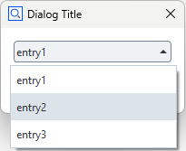

Selection list widget
: The Selection list widget allows to make a selection from a predefined set of options. The selected item can be accessed from a script through its object name (e.g. `selectionListWidget`) as follows.

``` python
selectedValue = DIALOG.selectionListWidget.value
print( selectedValue ) # output: entry2
```

| Property | Type        | Example                                                                                              |
| -------- | ----------- | ---------------------------------------------------------------------------------------------------- |
| tooltip  | str         | <pre>DIALOG.selectEntry.tooltip = 'Select one of the operating modes'</pre>                          |
| enabled  | bool        | <pre>DIALOG.selectEntry.enabled = False</pre>                                                        |
| value    | str         | <pre>DIALOG.selectEntry.value = 'Debug'</pre>                                                        |
| focus    | bool        | <pre>DIALOG.selectEntry.focus = True</pre>⚠️ Only works if dialog is open                           |
| visible  | bool        | <pre>DIALOG.select_mode.visible = False</pre>                                                        |
| items    | list of str | <pre>DIALOG.selectEntry.items = ['Debug', 'Info', 'Warn', 'Error', 'Fatal']</pre>                    |


#### Button widget

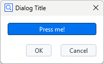


Button widget
: The Button widget allows to trigger an event or to return a boolean value, respectively. There are two types of buttons: push buttons and toggle buttons. The push button is a regular button and needs an event handler to manage its action. The toggle button has two states - active and inactive - and the user can toggle between them by clicking the button. The button is highlighted in active state as shown in the screenshot. The state of the toggle button can be accessed as follows.

``` python
toggleButtonState = DIALOG.toggleButtonWidget.value
print(toggleButtonState) # output: True
```

The buttons size and icon can be changed in the Dialog Editor.

| Property         | Type | Example                                                                                                               |
| ---------------- | ---- | --------------------------------------------------------------------------------------------------------------------- |
| tooltip          | str  | <pre>DIALOG.button.tooltip = 'Click to start evaluation'</pre>                                                        |
| enabled          | bool | <pre>DIALOG.button.enabled = False                                                                                    |
| value            | bool | <pre>if DIALOG.button.value:</pre>💡 Only for toggle button!                                                          |
| text             | str  | <pre>DIALOG.button.text = 'Click here!'                                                                               |
| type             | str  | <pre># Possible values: 'push', 'toggle'<br>DIALOG.button.type = 'toggle'<br>DIALOG.button.value = True</pre>         |
| icon_type        | str  | <pre># Possible values: 'none', 'file', 'system'<br># but see remark below!<br>DIALOG.button.icon_type = 'none'</pre> |
| icon_system_type | str  | <pre># Possible values: 'ok', 'cancel',<br># 'arrow_left', 'arrow_right', 'arrow_up', 'arrow_down'<br>DIALOG.button.icon_system_type = 'ok'</pre> |
| icon_system_size | str  | <pre># Possible values: 'default', 'large', 'extra_large'<br>DIALOG.button.icon_system_size = 'extra_large'</pre>     |
| visible          | bool | <pre>DIALOG.button.visible = False

💡 There are also values for file icons. These only work straightforward using the dialog designer but not from a script. You can only change between no icon and system icons in a straightforward way.

#### Radio button widget


Radio button widget
:  The Radio button widget enables the user to choose an option from a predefined set. Each option has a label and a unique ID, which both can be set in the scripting dialog editor by double clicking the widget. The IDs are 'ONE', 'TWO' and 'THREE' in the example below.

``` python
selectedChoice = DIALOG.radiobuttonsWidget.value
print( selectedChoice ) # output: ONE

if selectedChoice == 'ONE':
    print("IDs are strings.") # output: IDs are strings.
```

| Property | Type           | Example                                                                                                               |
| -------- | -------------- | --------------------------------------------------------------------------------------------------------------------- |
| tooltip  | str            | <pre>DIALOG.radiobuttons.tooltip = 'Choose one alternative!'</pre>                                                    |
| enabled  | bool           | <pre>DIALOG.radiobuttons.enabled = False</pre>                                                                        |
| value    | str            | <pre>DIALOG.radiobuttons.value = 'Value3'</pre>                                                                       |
| visible  | bool           | <pre>DIALOG.radiobuttons.visible = False</pre>                                                                        |
| items    | (special list) | <pre># Possible values is a list of lists of two strings.<br># Each first string is the returned value<br># Each second string is the entries' title<br>DIALOG.radiobuttons.items = [['Value1', 'Title1'], ['Value2', 'Title2'], ['Value3', 'Title3']]<br>DIALOG.radiobuttons.default = 'Value2'</pre> |
| default  | str            | <pre>DIALOG.radiobuttons.default = 'Value1'</pre>                                                                     |


#### Abort button widget


Abort button widget
: The Abort button widget aborts the current action. It is disabled if no action is currently executed. It behaves in the same manner as the abort button in the lower right corner of the ZEISS INSPECT software.


% To Do: Add enabled abort button. Check if the button still exists in ZEISS INSPECT.

#### Tolerances widget


Tolerances widget
: The Tolerances widget is a group of input widgets which allows to configure all parameters related to tolerances.

| Property         | Type                  | Example                                                                                  |
| ---------------- | --------------------- | ---------------------------------------------------------------------------------------- |
| tooltip          | str                   | <pre>DIALOG.tolerancesWidget.tooltip = 'Configure tolerances'</pre>                      |
| enabled          | bool                  | <pre>DIALOG.tolerancesWidget.enabled = False</pre>                                       |
| value            | (unspecified/various) |  The current value of the widget. Type depends on the widget type and can be 'none' for empty widgets. |
| focus            | bool                  | <pre>DIALOG.tolerancesWidget.focus = True</pre>⚠️ Only works if dialog is open           |
| visible          | bool                  | <pre>DIALOG.tolerancesWidget.visible = False</pre>                                       |
| expanded         | bool                  | <pre># Check if widged is expanded<br>if DIALOG.tolerancesWidget.expanded == True:</pre> |
| mode             | str                   | <pre># Tolerance mode ('no_tolerance', 'via_tolerance_table', 'from_cad', 'manual', 'from_element')<br> print( DIALOG.tolerancesWidget.mode )</pre> |
| upper            | double                | <pre>DIALOG.tolerancesWidget.upper = 0.3</pre>                                           |
| lower            | double                | <pre>DIALOG.tolerancesWidget.lower = 0.2</pre>
| use_warn_limit   | bool                  | <pre># Use warning levels<br>DIALOG.tolerancesWidget = True</pre>                        | 
| upper_warn       | bool                  | <pre>DIALOG.tolerancesWidget.upper_warn = 0.5</pre>                                      |
| lower_warn       | bool                  | <pre>DIALOG.tolerancesWidget.lower_warn = 0.4</pre>
| link_limits      | bool                  | <pre># Allow setting of upper / lower limits separately<br>DIALOG.tolerancesWidget.link_limits = False </pre> |
| unit             | str                   | <pre># Set unit ID<br>DIALOG.tolerancesWidget.unit = 'LENGTH'                            |

#### File system browser widget

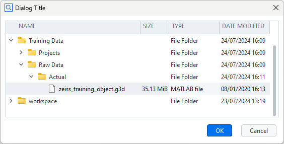

File system browser widget
: The File system browser widget allows to view the file system and to select a file or a set of files, respectively. A filter can be set to show only files with certain filename extensions.

| Property           | Type                  | Example                                                                                |
| ------------------ | --------------------- | -------------------------------------------------------------------------------------- |
| tooltip            | str                   | <pre>DIALOG.filesystemWidget.tooltip = 'Select CAD file'</pre>                         |
| enabled            | bool                  | <pre>DIALOG.filesystemWidget.enabled = False</pre>                                     |
| value              | (unspecified/various) |  The current value of the widget. Type depends on the widget type and can be 'none' for empty widgets. |
| focus              | bool                  | <pre>DIALOG.filesystemWidget.focus = True</pre>⚠️ Only works if dialog is open         |
| visible            | bool                  | <pre>DIALOG.filesystemWidget.visible = False</pre>                                     |
| root               | str                   | <pre>DIALOG.filesystemWidget.root = 'C:/Users'</pre>                                   |
| show_date          | bool                  | <pre>DIALOG.filesystemWidget.show_date = True</pre>                                    |
| show_size          | bool                  | <pre>DIALOG.filesystemWidget.show_size = True</pre>                                    |
| show_type          | bool                  | <pre>DIALOG.filesystemWidget.show_type = True</pre>                                    |
| use_multiselection | bool                  | <pre># Enable selection of multiple files<br>DIALOG.filesystemWidget.use_multiselection = True</pre> |                                                               
| selected           | list                  | <pre>print(DIALOG.filesystemWidget.selected)<br># example output: \['C:/temp/Basic_Training_GOM_Inspect_Pro/Training Data/Raw Data/Actual/GOM Training Object Mesh 1.g3d', 'C:/temp/Basic_Training_GOM_Inspect_Pro/Training Data/Raw Data/Actual/GOM Training Object Mesh 2.g3d'\]</pre> |
| filter             | list                  | <pre># Apply a filter of filename extensions<br>DIALOG.filesystemWidget.filter = \[ '\*.g3d', '\*.stp' \]</pre> |

### Widget text assignment and formatting at run time

The [Description field (label) widget](#description-field-label-widget) and the [Continuous text widget](#continuous-text-widget) support HTML / CSS syntax for text formatting and character encoding.

Example: Dialog with a label widget (`label`)

```{code-block} python
# Label - font size: 18 pt, style: bold, special character: 'Diameter'
DIALOG.label.text = '<span style="font-size:18pt"><b>Cylinder &#x2300;</b></span>'
```


Example: Continuous text widget (`cont_text`) with formatted text

```{code-block} python
# Continuous text - font size: 18 pt, font weight: 600, color: red, 
DIALOG.text.text = '<span style="font-size:18pt; font-weight:600; color:red;">Attention!</span>'
```

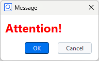

Example: Continuous text widget (`cont_text`) with a table containing values from variables

```{code-block} python
var1 = 9.8
var2 = 10
var3 = 0.3
var4 = "pass"

DIALOG.text.text = '<table width="200">'\
'<tr><th>Actual</th><th>Nominal</th><th>Tolerance</th><th>Result</th></tr>'\
f'<tr><td>{var1}</td><td>{var2}</td><td>{var3}</td><td>{var4}</td></tr></table>'
```


```{note}
In case a character string is not recognized as HTML code automatically, enclose it in `<html>` tags:

`DIALOG.label.text = '<html>Diameter &#x2300;</html>'`
```


## Executing dialogs

- [Dialog commands](#dialog-commands)
    - [Break dialog (`execute`)](#break-dialog-execute)
    - [Extendable break dialog (`create` and `show`)](#extendable-break-dialog-create-and-show)
    - [Info dialog (`create`, `open` and `close`)](#info-dialog-create-open-and-close)
- [Dialog results](#dialog-results)
    - [Custom results](#custom-results)
- [Configuring dialog widgets](#configuring-dialog-widgets)
- [Event handler functions](#event-handler-functions)
    - [Registering event handlers](#registering-event-handlers)
    - [Closing dialogs from within the event handler](#closing-dialogs-from-within-the-event-handler)
    - [Using a timer to activate the event handler](#using-a-timer-to-activate-the-event-handler)
- [Determining the existing widget attributes](#determining-the-existing-widget-attributes)

### Dialog commands

#### Break dialog (`execute`)


* Standard case of a dialog.
* The dialog is created and executed with a single command.
* The command blocks the script until the dialog is closed again.
* The dialog result is returned.


``` python
RESULT=gom.script.sys.execute_user_defined_dialog (dialog={
    "content": [
        [
            {
                "columns": 1,
                "name": "label",
                "rows": 1,
                "text": {
                    "id": "",
                    "text": "Distance",
                    "translatable": True
                },
                "tooltip": {
                    "id": "",
                    "text": "",
                    "translatable": True
                },
                "type": "label",
                "word_wrap": False
            },
            {
                "background_style": "",
                "columns": 1,
                "maximum": 1000,
                "minimum": 0,
                "name": "inputDistance",
                "precision": 2,
                "rows": 1,
                "tooltip": {
                    "id": "",
                    "text": "",
                    "translatable": True
                },
                "type": "input::number",
                "unit": "",
                "value": 0
            }
        ]
    ],
    "control": {
        "id": "OkCancel"
    },
    "embedding": "always_toplevel",
    "position": "automatic",
    "size": {
        "height": 112,
        "width": 198
    },
    "sizemode": "automatic",
    "style": "",
    "title": {
        "id": "",
        "text": "Distance",
        "translatable": True
    }
})

```

#### Extendable break dialog (`create` and `show`)

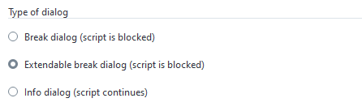

* A dialog is created and executed by subsequent commands.
* This way, the created dialog can be modified by the script right before execution.

```{code-block} python
:caption: Creating and executing a dialog with two separate commands

# Create dialog, but do not execute it yet
DIALOG = gom.script.sys.create_user_defined_dialog (content='...')

#
# The dialog has been created. At this point of the script, the dialog handle DIALOG
# can be used to access and configure dialog parts
#

# Execute dialog and fetch execution result
RESULT = gom.script.sys.show_user_defined_dialog( dialog = DIALOG )
```

#### Info dialog (`create`, `open` and `close`)

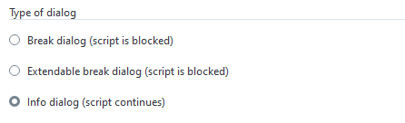

* In this mode, the script execution continues after the dialog has been opened.
* The sequence of commands is as follows:
    * the `create` command creates a dialog. The dialog can be configured now. Afterwards
    * the `open` command is issued to display the dialog. The script executing continues. At last
    * the `close` command closes the dialog again, if no closed manually by the user yet.

💡 At script termination all open dialogs are closed automatically.

```{code-block} python
:caption: Non blocking configurable dialogs

# Create dialog but do not execute it yet
DIALOG = gom.script.sys.create_user_defined_dialog (content='...')

#
# The dialog has been created. At this point of the script, the dialog handle DIALOG
# can be used to access and configure dialog parts
#

# Show dialog. The script execution continues.
gom.script.sys.open_user_defined_dialog( dialog = DIALOG )

#
# The dialog content can be modified here, the dialog is still open
#
DIALOG.title = 'Stufe 2'

# Close dialog again
gom.script.sys.close_user_defined_dialog (dialog=DIALOG)
```

### Dialog results

💡 The return value is an object with one property per interactive dialog widget containing its current value.

* The return value is an object containing all current values.
* Each dialog widget which can be changed by the script user writes its resulting value into this result object.
* The key for each widget is its object name, which is unique.


``` python
#
# Print whole dialog result as an object. This is a result map with just one entry 'distance',
# named after the unique object name assigned to the spinbox (decimal widget).
#
print (RESULT) # Print whole result map
# output: gom.dialog.DialogResult ('distance': 2.0, 'label': None)

#
# Print result for the element named 'distance'. This will lead to the decimal widget content.
#
print (RESULT.distance)
# output: 2.0

#
# Print whole dialog result as a dictionary with the same content as above. 
#
print (RESULT.__dict__)
# output: {'__args__': [{'distance': 2.0, 'label': None}], '__kwargs__': {}}
print (RESULT.__dict__['__args__'][0])
# output: {'distance': 2.0, 'label': None}
```


``` python
# Print content of the 'name' widget
print( RESULT.name )
# output: Line 1

# Print content of the widget named 'point1'. This can again be an element reference.
print( RESULT.point1 )
# output: gom.ActualReference (gom.app.project.inspection['Point 5'])

# Print content of the widget named 'point2'.
print( RESULT.point2 )
# output: gom.ActualReference (gom.app.project.inspection['Point 6'])

# construct a line with the user input. Therefore our dialog works similar to the 2-point line
# construction dialog
MCAD_ELEMENT=gom.script.primitive.create_line_by_2_points (
    name= RESULT.name,
    point1 = RESULT.point1,
    point2 = RESULT.point2)
```

💡 The type of the result depends on the specific widget.

#### Custom results

You can return custom results from dialogs using an optional parameter to the `close_user_defined_dialog`-function. The following example produces 'Yes' 
and 'No' results for the different buttons and 'Cheater' when the user uses the close button of the dialog.

``` python
DIALOG = gom.script.sys.create_user_defined_dialog (content='...')

#
# Event handler function called if anything happens inside of the dialog
#
def dialog_event_handler (widget):
    if widget == DIALOG.button_yes:
        gom.script.sys.close_user_defined_dialog( dialog = DIALOG, result = 'Yes' )
    if widget == DIALOG.button_no:
        gom.script.sys.close_user_defined_dialog( dialog = DIALOG, result = 'No' )

DIALOG.handler = dialog_event_handler

try:
    RESULT = gom.script.sys.show_user_defined_dialog (dialog=DIALOG)
except gom.BreakError as e:
    RESULT = 'Cheater'

print('RESULT', RESULT)
```

Please find the complete example here: [dialog_yes_no.py](assets/dialog_yes_no.py)

### Configuring dialog widgets

* Dialogs created with the `create` and `open` commands can be modified before executed.
* Each widget in the dialog can be accessed via the dialog handle.
* The widget is identified by its unique name.

```{code-block} python
:caption: Configuring dialog widgets

# Create dialog and receive dialog handle
DIALOG = gom.script.sys.create_user_defined_dialog (content='...')

# The handle for a widget inside of the dialog is addressed by its unique name
WIDGET = DIALOG.distance

# The widget parameter can be set via widget attributes. 'Value', for instance, relates to the current widget value.
WIDGET.value = 3.0
```

* All widgets share some common standard attributes:

| Attribute | Type                | Property                                  |
| --------- | ------------------- | ----------------------------------------- |
| name      | str                 | Unique name of the widget - do not write! |
| enabled   | bool                | Widget is currently active / inactive     |
| value     | (depends on widget) | Current value                             |

For the type of the value property for a specific widget, see section [Specific widgets](#specific-widgets) above. For widgets which are not used to enter some value, `value` is `None` and read-only. In addition, widgets have further attributes depending on their type (see section [Specific widgets](#specific-widgets) above for details).

```{code-block} python
:caption: Accessing widget attributes

# Create dialog but do not execute it yet
DIALOG=gom.script.sys.create_dialog (content='...')

# Set name to 'default name' and disable 'ok' button
DIALOG.name.value = "default name"
DIALOG.control.ok.enabled = False

# Execute dialog
RESULT=gom.script.sys.show_user_defined_dialog (dialog=DIALOG)
```

### Event handler functions

#### Registering event handlers

* A function can be registered to the dialog called on value changed.
* Every time the user modified a dialog value, the **handler** function is called.
* The handler function is also called on application global signals, e.g. when application data has been changed. In these cases is the string `'system'` passed to the handler function. Those global signals are caused by changing the element selection or opening a project for example.
* The handler function can access dialog widget properties.
* The handler function is registered using the special attribute `handler`.
* The **prev** and **next** buttons of a wizard dialog are the only control widgets, which trigger the event handler.

```{code-block} python
:caption: Dialog handler functions

DIALOG=gom.script.sys.create_user_defined_dialog (content='dialog definition')

# Handler function registered to the dialog
def handler_function (widget):
    # Print information about the modified widget
    print ("Modified:", str (widget))
    # If the 'name' widget is empty, the 'ok' button is disabled.
    if DIALOG.name.value == "":
        DIALOG.control.ok.enabled = False
    else:
        DIALOG.control.ok.enabled = True

    if str(widget) == 'system':
        print("It is a global event.")
    elif str(widget) == 'initialize':
        print("Dialog is displayed for the first time.")

# Register dialog handler
DIALOG.handler = handler_function

# Execute dialog
RESULT=gom.script.sys.show_user_defined_dialog (dialog=DIALOG)
```

A complete example with a handler function can be found in the file [scriptingEditorExampleDialog.py](assets/scriptingEditorExampleDialog.py). The argument passed to the event handler is either the dialog widget (e.g. a button) which triggered the event handler or a string. The following table lists all possible strings:

| Value        | Description                                                                  |
| ------------ | ---------------------------------------------------------------------------- |
| 'system'     | Passed to the event handler in the case of a global event.                   |
| 'timer'      | Passed to the event handler in the case of a global event.                   |
| 'initialize' | Passed to the event handler when the dialog is displayed for the first time. |

If the widget parameter is not a string, it represents a widget object. Note, that you cannot use the `is` operator on these objects. Always use `==` and similar 
operators to compare the widget parameter:

```{code-block} python
:caption: Comparing widget parameters

def handler_function (widget):
    ...
    # compare widget using "==", using "is" will not work!
    if widget == DIALOG.textInput:
        if DIALOG.textInput.value == "":
            DIALOG.control.ok.enabled = False
        else:
           DIALOG.control.ok.enabled = True
```

#### Closing dialogs from within the event handler

💡 Dialogs can be closed from within event handlers.


```{code-block} python
:caption: Button event handler

def dialog_event_handler (widget):
    if widget == DIALOG.button1:
        execute_func_1 ()
        gom.script.sys.close_user_defined_dialog (dialog=DIALOG)
    elif widget == DIALOG.button2:
        execute_func_2 ()
        gom.script.sys.close_user_defined_dialog (dialog=DIALOG)
    elif widget == DIALOG.button3:
        execute_func_3 ()
        gom.script.sys.close_user_defined_dialog (dialog=DIALOG)
```

⚠️ Right after the dialog has been closed its handle becomes invalid.

This implies, that the event handler function must be written in a way that no dialog dependent code is executed after the dialog has been closed.

#### Using a timer to activate the event handler

Each `DIALOG` has a special property named `DIALOG.timer`. This timer property can be used to trigger the event handler registered to `DIALOG` in 
certain time intervals. When the event handler is triggered by the timer, the string `timer` is passed to it. The `__doc__`-string of the timer gives information 
about its attributes:

``` python
print(DIALOG.timer.__doc__)
# output:
# Timer
#
# Attributes:
# enabled (boolean) - timer enabled
# interval (integer) - timer interval [ms]
```

💡 Please note that the timer is disabled by default.

Example:


```{code-block} python
:caption: Button/Timer event handler

DIALOG=gom.script.sys.create_user_defined_dialog (content='boring dialog definition')

#
# Event handler function called if anything happens inside of the dialog
#
state = False
def dialog_event_handler (widget):
    global state
    if widget == DIALOG.start:
        DIALOG.timer.interval = DIALOG.interval.value * 1000
        DIALOG.timer.enabled = True
        DIALOG.start.enabled = False
        DIALOG.stop.enabled = True
    elif widget == DIALOG.stop:
        DIALOG.timer.enabled = False
        DIALOG.start.enabled = True
        DIALOG.stop.enabled = False
    elif widget == DIALOG.interval:
        DIALOG.timer.interval = DIALOG.interval.value * 1000
    elif widget == DIALOG.exit:
        gom.script.sys.close_user_defined_dialog (dialog=DIALOG)
    elif str(widget) == 'system':
        print("Its a system event.")
    elif str(widget) == 'timer':
        print("Its a timer event. Let´s swap the image.")
        state = not state
     
        if state:
            DIALOG.image.system_image = 'system_message_warning'
        else:
            DIALOG.image.system_image = 'system_message_question'

DIALOG.handler = dialog_event_handler
DIALOG.stop.enabled = False
RESULT=gom.script.sys.show_user_defined_dialog (dialog=DIALOG)
```

The complete code of the example can be found here: [timer.py](assets/timer.py). 

### Determining the existing widget attributes

* Because Python is a very dynamic language, the type of a variable or attribute can not be determined statically.
* Instead, it is possible to query the variable dynamically during runtime.
* The more commonly used widget attributes are documented in the section [Specific widgets](#specific-widgets) above.

💡 Most objects support the attribute `__doc__` which prints the available object documentation to the console.

```{code-block} python
:caption: Print object documentation

#
# Query __doc__ attribute of a button widget
#
print (DIALOG.my_button.__doc__)
# output:
# Handle for a widget called 'my_button' of type 'Button' (button::pushbutton)
#
# Attributes:
# name             (string)              - Name of the widget. The name can be used to access the widget via a dialog handle.
# tooltip          (string)              - Tooltip of the widget. If empty, no tooltip is displayed.
# enabled          (boolean)             - Enabled state of the widget. Default is 'enabled', set to false for disabling it.
# value            (unspecified/various) - The current value of the widget. Type depends on the widget type and can be 'none' for empty widgets.
# attributes       (map)                 - Map of all accessable widget attributes together with their current values.
# focus            (boolean)             - Focus state of the widget. Can be used to set an explicit widget focus.
# text             (string)              - Text of the button
# type             (string)              - Button type ('push', 'toggle')
# icon             (Tom::Parse::Binary)  - Icon of the button
# icon_file_name   (string)              - Source file name of the icon
# icon_size        (string)              - Icon size mode (icon, full)
# icon_type        (string)              - Icon type (none, system, file)
# icon_system_type (string)              - System icon type (ok, cancel, arrow_up, arrow_down, arrow_left, arrow_right)
# icon_system_size (string)              - System icon size (default, large, extra_large)
```

## Wizards

- [Control widgets](#control-widgets)

* **Wizards** are dialogs with **\< Back** and **Next \>** buttons at the lower dialog edge.
* The script programmer is responsible for adding functionality to this layout.
* Wizards are not very versatile, but modifying the displayed texts and images is easily possible.

⚠️ It is not possible to exchange widgets from within a dialog after the dialog has been created!

Therefore Wizards only have simple options like exchange of images and texts in those containing elements.

### Control widgets

The operational elements in a control widget from a wizard do act like those in regular dialogs und can be accessed via handles as well:

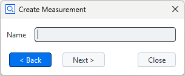

```{code-block} python
:caption: Wizard example

#
# Create dialog with wizard control panel
#
DIALOG=gom.script.sys.create_user_defined_dialog (content='boring dialog definition')
#
# Handler function to be registered to the dialog
#
def func (widget):
    #
    # Handle clicks onto the 'prev' button
    #
    if widget == DIALOG.control.prev:
        # Here you would write code to display the content of the previous wizard 'page'
        
        #
        # Handle clicks onto the 'next' button
        #
        print("Prev button was clicked.")
    elif widget == DIALOG.control.next:
        # Here you would write code to display the content of the next wizard 'page'
        
        #
        # Update dialog button enabled state and register handler function
        #
        print("Next button was clicked.")

DIALOG.handler = func

#
# Execute wizard dialog
#
RESULT=gom.script.sys.show_user_defined_dialog (dialog=DIALOG)
```

[Creating wizard dialogs](creating_wizard_dialogs.md) shows some ways to manage wizard dialogs in greater detail. 
