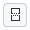

# User-defined Dialogs

- [Creating dialogs](#creating-dialogs)
- [Dialog widgets](#dialog-widgets)
- [Executing dialogs](#executing-dialogs)
- [Wizards](#wizards)

# Creating dialogs

- [Dialog designer](#dialog-designer)
- [Dialog layout](#dialog-layout)
    - [Editing the grid](#editing-the-grid)
    - [Spacers](#spacers)
- [Widgets](#widgets)
    - [Inserting and removing widgets](#inserting-and-removing-widgets)
    - [Configuring widgets](#configuring-widgets)
- [Editing already created dialogs](#editing-already-created-dialogs)

## Dialog designer

* User defined dialogs can be inserted into the script using "Insert / Dialog..." from the right mouse menu.


* When a new dialog is inserted, a dialog template and type can be selected.


* Dialogs are designed using a GUI based dialog editor.


## Dialog layout

* The dialog designer is using a grid based layout.
* Elements can be inserted into the grid via drag and drop.

### Editing the grid

💡 Editing the layout means changing the underlying grid.

* Because the underlying layout is a grid, the following actions are possible:
    * Adding and removing rows and columns.
    * Merging and splitting rows and columns.

| Tool button                              | Function                          |
| ---------------------------------------- | --------------------------------- |
|    | Split selected cells vertically   |
|  | Split selected cells horizontally |
|               | Merge selected cells              |

* Selected cells are marked with a red overlay.


### Spacers

💡 **Spacers** are empty spaces extending in either horizontal or vertical direction.

* If a spacer is inserted into a cell, the cell claims the maximum available space in spacer direction.
* All remaining cells share the remaining space.


## Widgets

### Inserting and removing widgets

* The list of available widgets resides at the left of the dialog designer.
* Widgets are inserted via drag and drop.
* Newly dropped widgets overwrite widgets at the drop target cells.
* A unique name object name is assigned during insertion of a widget. This name is used to access the widget in the Python script.

💡 Removing widgets from the grid is not possible. Instead, they can be overwritten by other widgets.

* Because each cell has to be filled with a widget, widgets can not be removed from the grid. To get rid of a widget
    * Another widget can be dragged and dropped onto the existing widget or
    * The widget cell can be merged with another cell.


### Configuring widgets

* The properties of selected widgets can be edited in the property editor at the right side of the designer dialog.
* Every widget has at least a unique name.
* Additionally, various parameters depending on the widget type can be edited.


The definition of the dialog can be found in `scriptingEditorExampleDialog.py`

## Editing already created dialogs

* Creating a dialogs leads to a script command with embedded dialog representation as XML code.
* Double clicking onto this command opens the dialog editor again

# Dialog widgets

- [Use of the \_\_doc\_\_ string](#use-of-the-__doc__-string)
- [Control widget](#control-widget)
    - [Control widget elements](#control-widget-elements)
    - [Control button properties](#control-button-properties)
    - [The status label](#the-status-label)
- [Specific widgets](#specific-widgets)
    - [Text fields](#text-fields)
    - [Images](#images)
    - [Log widget](#log-widget)
    - [Progress-bar widget](#progress-bar-widget)
    - [Integer widget](#integer-widget)
    - [Decimal widget](#decimal-widget)
    - [Text entry field](#text-entry-field)
    - [Slider widget](#slider-widget)
    - [Checkbox widget](#checkbox-widget)
    - [File widget](#file-widget)
    - [Date widget](#date-widget)
    - [Color widget](#color-widget)
    - [Selection element widget](#selection-element-widget)
    - [Selection list widget](#selection-list-widget)
    - [Button widget](#button-widget)
    - [Radio button widget](#radio-button-widget)
    - [Abort button widget](#abort-button-widget)

This section gives an overview of the available widgets. If the code examples given in this section are not intuitive to you, you might want to take a look 
into [Executing dialogs](#executing-dialogs).

## Use of the \_\_doc\_\_ string

Information about the widgets can be obtained by accessing their doc string. Let objName be the object name of a widget and DIALOG the dialog handle 
(see [Executing dialogs](#executing-dialogs) if this is unclear to you), the doc string can be obtained as follows:

```
print( DIALOG.objName.__doc__ )
```

## Control widget

💡 The control widget contains the ok/cancel or similar buttons of the dialog.

* The control element of a dialog cannot be configured like other dialog widgets.
* Therefore, their name is fixed and they are grouped together inside of the control widget named 'control'.
* The control elements consist of the dialogs lower buttons plus a configurable dialog status label.

| Handle                    | Property                                  | Example                                     |
| ------------------------- | ----------------------------------------- | ------------------------------------------- |
| DIALOG.control            | Control widget                            | -                                           |
| DIALOG.control.status     | Status icon of the control widget         | `DIALOG.control.status = 'Point 1 missing'` |
| DIALOG.control.\<button\> | Handle for a button of the control widget | `DIALOG.control.ok.enabled = False`         |

### Control widget elements

💡 The names of the control widget elements are fixed

* Usually, the names are corresponding with the elements' semantics. For example, the name of the 'ok' button is 'ok'. The names can also be 
obtained from the \_\_doc\_\_ string as shown in the code example below.
* The control elements are accessed like all other widget attributes.

> Accessing the control widget

```
# Print control widget properties
> print (DIALOG.control.__doc__)
ControlGroup
Attributes:
status (string) - Status tool tip icon
ok (unspecified/various) - Control widget
cancel (unspecified/various) - Control widge
```

### Control button properties

Control buttons only have the following two properties which can be set programmatically:

| Property | Type | Example                                 |
| -------- | ---- | --------------------------------------- |
| text     | str  | `DIALOG.control.prev.text = 'Previous'` |
| enabled  | bool | `DIALOG.control.ok.enabled = False`     |

### The status label

⚠️ The status label of the control widget is invisible until a status text is set.

* If a status text is set, a small warning icon appears, like in regular applications' dialogs.
* The status label can be configured using its properties like all other widgets.

| Dialog | Code |
| ------ | ---- |
| (figure)       | <pre>DIALOG=gom.script.sys.create_user_defined_dialog (content='dialog definition')<br># Set status label text<br>DIALOG.control.status = 'No point selected.'<br># Set 'ok' button to insensitive<br>DIALOG.control.ok.enabled = False<br>gom.script.sys.show_user_defined_dialog(dialog = DIALOG)</pre> |

You can reset the status icon and clear the error message by assigning an empty string (`DIALOG.control.status = ''`).

## Specific widgets

### Text fields

* Text field widgets are able to display multi lines text.
* In these texts keywords can also be displayed.
* A double click onto a text field widget opens a content editor.

| Dialog    | Code |
| --------- | ---- |
| (figure)  | <pre># The 'data' attribute contains the image data (shortened version here)<br>RESULT=gom.script.sys.execute_user_defined_dialog<br>(content='\<dialog\>' \\<br>' \<title\>About\</title\>' \\<br>' \<control id="Close" /\>' \\<br>' \<content rows="1" columns="1" \>' \\<br>' \<widget rowspan="1" row="0" column="0" columnspan="1" type="image" \>' \\<br>' \<name\>image\</name\>' \\<br>' \<data\>\<!\[CDATA\[eAEdWgVUFd0WHkK4IEiHSHengdKIooCA...\</data\>' \\<br>' \<file_name\>/home/develop/fcieslok/gom.jpg\</file_name\>' \\<br>' \</widget\>' \\<br>' \</content\>' \\<br>'\</dialog\>')</pre> |

| Editor    | Dialog   |
| --------- | -------- |
| (figure)  | (figure) |

* The keywords displayed in text field widgets can originate from different source:
    * Global application keywords,
    * project related keywords and
    * local script variables.

⚠️ Local script variables can be displayed in text fields by inserting them via the 'insert expression' dialog.

* Local script variables are invalid until the variable assignment is reached. They cannot be displayed statically in the text field editor prior to script 
execution, so an invalid value (???) will most certainly be displayed instead.

| Property | Type | Example                             |
| -------- | ---- | ----------------------------------- |
| enabled  | bool | `DIALOG.textWidget.enabled = False` |
| text     | str  | `print(DIALOG.textWidget.text)`     |
| wordwrap | bool | `DIALOG.textWidget.wordwrap = True` |
| visible  | bool | `DIALOG.label_name.visible = False` |

### Images

### Log widget

### Progress-bar widget

### Integer widget

### Decimal widget

### Text entry field

### Slider widget

### Checkbox widget

### File widget

### Date widget

### Color widget

### Selection element widget

### Selection list widget

### Button widget

### Radio button widget

### Abort button widget

# Executing dialogs

- [Dialog commands](#dialog-commands)
    - [Blocking fixed dialogs (`execute`)](#blocking-fixed-dialogs-execute)
    - [Blocking configurable dialogs (`create` and `show`)](#blocking-configurable-dialogs-create-and-show)
    - [Non-blocking configurable dialogs (`create`, `open` and `close`)](#non-blocking-configurable-dialogs-create-open-and-close)
- [Dialog results](#dialog-results)
    - [Custom results](#custom-results)
- [Configuring dialog widgets](#configuring-dialog-widgets)
- [Event handler functions](#event-handler-functions)
    - [Registering event handlers](#registering-event-handlers)
    - [Closing dialogs from within the event handler](#closing-dialogs-from-within-the-event-handler)
    - [Using a timer to activate the event handler](#using-a-timer-to-activate-the-event-handler)
- [Determining the existing widget attributes](#determining-the-existing-widget-attributes)

## Dialog commands

### Blocking fixed dialogs (`execute`)

### Blocking configurable dialogs (`create` and `show`)

### Non-blocking configurable dialogs (`create`, `open` and `close`)

## Dialog results

### Custom results

## Configuring dialog widgets

## Event handler functions

### Registering event handlers

### Closing dialogs from within the event handler

### Using a timer to activate the event handler

## Determining the existing widget attributes

# Wizards

- [Control widgets](#control-widgets)

## Control widgets


