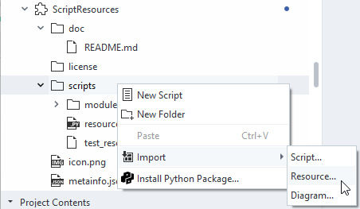

# Using script resources

The term "resource" is used to describe any files in your scripts directories that are not python scripts (`*.py`). You can use these files to include binary data such as images or other data like config files etc. in your Apps.

## Importing resources

The resources files in your scripts directory are automatically recognized as such. You can as well add (import) resources using the context menu of the script editor.

 

## Usage in scripts

To get access to resource data in a script, the qualified name or relative path to the resource is needed.
The qualified name starts with a `:` followed by the top-level folder and the path to the resource, e.g. `:PythonApiExamples/examples/script_resources/test_resource.txt`. You can also use a relative path to the currently executed script.

```{hint}
When using relative paths, the path is resolved to the script *currently executed*. This is not inevitably the script containing the `gom.Resource` call. E.g., when you import a script (A) containing a `gom.Resource` call in another script (B) and then execute the script (B), script (B) will be the *currently executed* one. In this case, usage of qualified names is advised.
```

Suppose you created a script called `resource_example.py` in a folder next to `test_resource.txt`. In the script, you can read the data in the following way:

```python
res = gom.Resource ("test_resource.txt")
if (res.exists()):
   print (res.open().read())
```

## See also

* [Examples of category `script_resources`](../../python_examples/script_resources.md)
* [`gom.Resource` API Definition](../../python_api/resource_api.md)