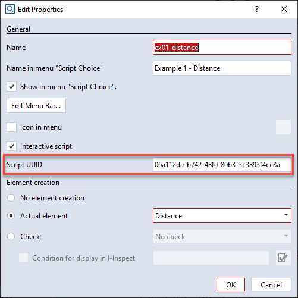

# Creating and modifying scripted elements from scripts

## Non-interactive creation

You use the command `gom.script.sys.create_element_by_script()` to create a scripted element from a script without opening its dialog. This example uses the example App <a href="https://github.com/ZEISS/zeiss-inspect-app-examples/blob/main/AppExamples/scripted_actuals/ScriptedActualDistance/doc/Documentation.md">ScriptedActualDistance</a>:

```{code-block} python
:caption: create_distance.py
import gom

# Create scripted distance using ex01_distance.py
element = gom.script.sys.create_element_by_script (
    check_type = 'none',
    element_type = 'distance',
    name = 'Distance 1',
    parameters = {
        'p1_x': 10.0, 'p1_y':  2.0, 'p1_z':  3.0, 
        'p2_x': -1.0, 'p2_y': -2.0, 'p2_z': -3.0
    },
    script_uuid = '06a112da-b742-48f0-80b3-3c3893f4cc8a'
)
```

You get the `script_uuid` from the scripted element's script properties:



This functionality is also used in the `Python API Examples` App's script tests.

## Non-interactive modification

You modify an element interactively using RMB ► Edit Creation Parameters in the Explorer. You achieve the same from a script with the command `gom.script.sys.edit_creation_parameters()`. To disable invocation of the dialog, the parameter `nodialog` has been added:

```{code-block} python
:caption: modify_distance.py

import gom

# Modify scripted element created with ex01_distance.py
gom.script.sys.edit_creation_parameters (
    element = gom.app.project.actual_elements['Distance 1'],
    parameters = {
      'p1_x': -10.0, 'p1_y':  2.0, 'p1_z':  3.0,
      'p2_x':  -1.0, 'p2_y': -2.0, 'p2_z': -3.0, 
      'nodialog': True},
)
```

```{code-block} python
:caption: Scripted element Python source code

def dialog(context, params):
    if 'nodialog' in params and params['nodialog'] == True:
        params['nodialog'] = False
        return params
    
    # ...
```
