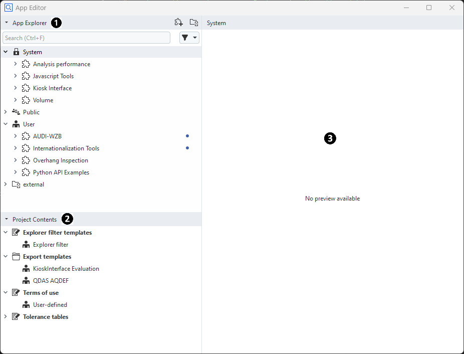
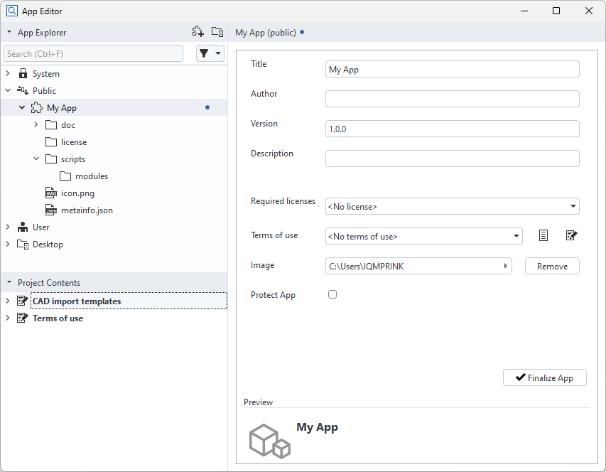
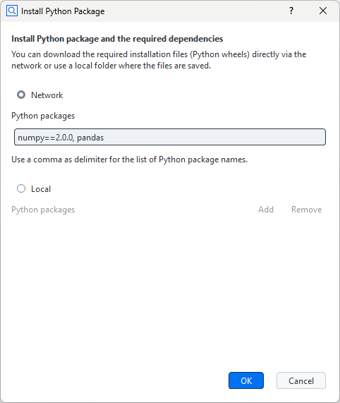
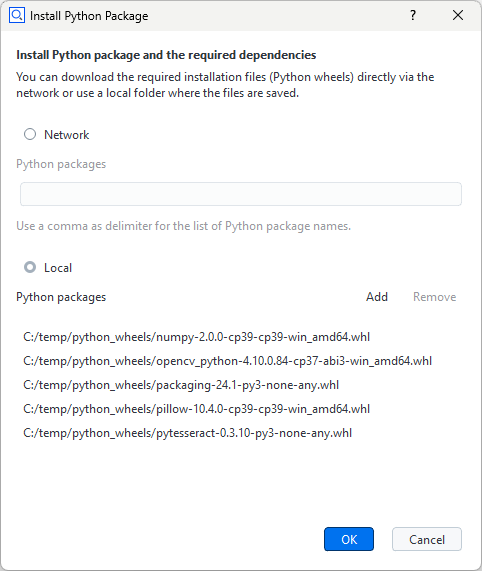
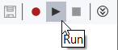
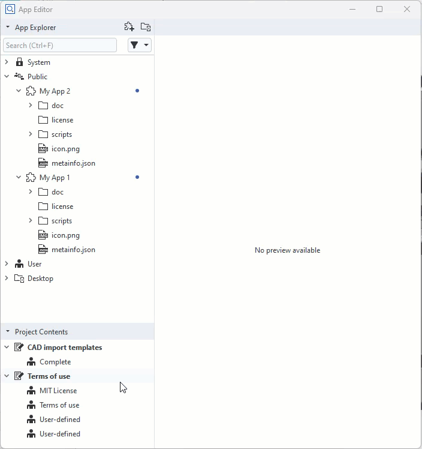
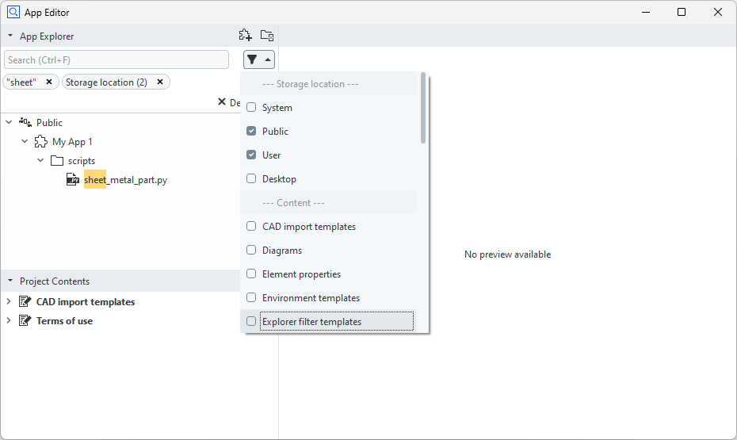

# Using the App Editor

With the App Editor, you write Python scripts, add/remove contents, create/edit, export and publish Apps.

See the ZEISS Quality Tech Guide article [App Editor](https://techguide.zeiss.com/en/zeiss-inspect-2023/article/cmd_sys_manage_add_ons.html) for more details.

- [App Editor Layout](#app-editor-layout)
- [Creating a new App](#creating-a-new-app)
- [Entering and Leaving Editing Mode](#entering-and-leaving-editing-mode)
- [Writing Python scripts](#writing-python-scripts)
  * [New Folder or Script](#new-folder-or-script)
  * [Installing Python packages](#installing-python-packages)
  * [Running Python Scripts](#running-python-scripts)
  * [Recording Commands](#recording-commands)
  * [Inserting Element Values](#inserting-element-values)
  * [Inserting a File Selection Dialog](#inserting-a-file-selection-dialog)
- [Adding and Removing Contents](#adding-moving-and-copying-contents)
- [Searching and Filtering](#searching-and-filtering)
- [Exporting or Publishing an App](#exporting-or-publishing-an-app)
- [Apps from External Folders](#apps-from-external-folders)
  * [Connecting and Disconnecting External Folders](#connecting-and-disconnecting-external-folders)
  * [Creating Apps in External Folders](#creating-apps-in-external-folders)

## App Editor Layout



1. App Explorer

    The App Explorer shows all installed Apps. The professional version of ZEISS INSPECT already provides some system Apps which you cannot delete or modify.
    
    Install additional Apps with one of the following methods:
    * Open the "Install/Uninstall Apps" dialog from the main menu
    * By drag&amp;drop into the App Explorer
    * By RMB ► Import App... in the App Explorer  
    * By using the ZEISS Quality Software Store
    
    Apps can be installed in the User folder or in the Public folder. Additionally, external folders can be connected.
    
2. Project Contents

    The Project Contents section contains all items in your active project, e.g. templates, report styles etc. Add these items by dragging and dropping them to your App in the App Explorer. You can copy or move contents between the Project Contents section and your App or between Apps.

3. Preview / Editor

    The Preview / Editor section shows the contents of a file depending on its file type. If the selected App is in editing mode, App properties or script contents can be edited here.  

## Creating a new App

Create a new App in the following ways:
* By using the "Create App" button in the top-right corner of the App Explorer 
* By using RMB ► Create App on the Public folder or the User folder
* By using RMB ► Create App on a connected external folder

A newly created App has the default title "My App". Rename your App in the properties dialog on the right. A blue dot next to the App title indicates that the App is in editing mode.

An new App has a set of default folders and files.

**Default Folders and Files of an App**



## Entering and Leaving Editing Mode

Before you can modify an installed App, you must set it to editing mode first. A newly created App is already in editing mode.

Set an App to editing mode
* By using RMB ► Edit on the App root node in the App Explorer or
* By clicking the Edit App button in the App properties window.

A blue dot next to the App title indicates that the App is in editing mode.

When you have finished editing the App, you can leave the editing mode
* By using RMB ► Finalize App on the App's root node in the App Explorer or
* By clicking the Finalize App button in the App properties window.

```{note}
An App can only be finalized after all mandatory information has been entered in the App properties dialog.
```

## Writing Python Scripts

### New Folder or Script

Click RMB on the 'scripts' folder of an App (in editing mode) ► New Folder/Script

### Installing Python Packages

Python packages can be installed into an App. The installed Python packages are only available to scripts in this specific App. This concept is like in [Conda](https://docs.conda.io/en/latest/) or [VirtualEnv](https://virtualenv.pypa.io/en/latest/). If you click RMB on the 'scripts' folder or 'modules' folder and select ► Install Python Packages..., the dialog for the installation is shown.

* From network
    The package list from network must be separated with a comma. To install the packages of a specific version, write the version after “==”, e.g. `numpy==1.22.0`

    

* From local file system
    Python wheel files (*.whl) can be added or removed.

    

### Running Python Scripts



You start or stop script execution with the buttons in the top right corner of the Script Editor.

### Recording Commands

You start or stop recording of commands executed in ZEISS INSPECT by using the Record button in the top right corner of the Script Editor. The recorded commands can be edited afterwards.

### Inserting Element Values

You insert objects from ZEISS INSPECT into your Python script by using RMB ► Insert ► Element Value in the script editor.

### Inserting a File Selection Dialog

You insert a file selection dialog in your Python script by using RMB ► Insert ► File... in the script editor. See [Selecting a file or folder](../python_api_introduction/file_selection_dialog.md) for details.

## Adding, Moving and Copying Contents

A project must be opened to provide items in the Project Contents section. An App must be in editing mode to allow adding or removing contents. You copy or move contents between the Project Contents section and an App or between two Apps by drag&amp;drop. You remove content from an App with RMB ► Delete... Based on the content types, the App folder structure is maintained automatically.



## Searching and Filtering



To ease working with a large number of installed Apps, searching and filtering can be used. The search function allows to enter parts of a file name. The search keyword can then be applied as a filter. An additional function allows to filter by storage location and content type.

## Exporting or Publishing an App

* Export

    Click RMB on the installed App ► Export: Save the selected App as a .addon file.

* Publish in Software Store

    Click RMB on the installed App ► Publish in Software Store: Upload the selected App into the Zeiss Quality Software Store. The uploaded App will be queued into the staging area and will be release after approval.
    
    ```{note}
    Publishing an App requires special permission that ZEISS grants upon request.
    ```

## Apps from External Folders

### Connecting and Disconnecting External Folders


External Folder enables the user to run scripts from a selected path. More than one external folders can be added.

* Connecting

    Click RMB in an area of the App Explorer where no object is selected ► Connect External Folder...
    
* Disconnecting

    Click RMB on the external folder you want to delete ► Disconnect...
    
    The External Folder is removed from the App Explorer but its contents remain in the file system.

### Creating Apps in External Folders

* Creating a new App in an external folder
    
    Click RMB on the External Folder ► New App

"Finalize App" is not available for Apps from external folders, however they can be published, although they are considered still to be work in progress.
