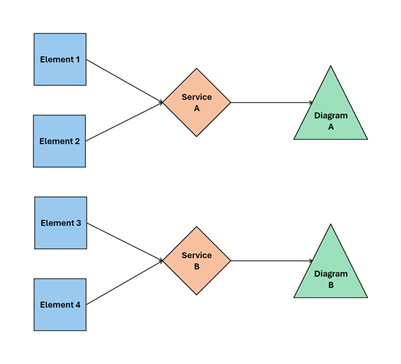

# Using scripted diagrams


> Abstract: Scripted diagrams allow visualization of any kind of data available within ZEISS INSPECT in any diagram style provided by Python packages like [Matplotlib](https://matplotlib.org/) or user-defined code. Scripted diagrams are a complement to the ZEISS INSPECT built-in [diagrams](https://techguide.zeiss.com/en/zeiss-inspect-2023/article/general_view_diagram.html). They receive data from specific [scripted elements](../scripted_elements/scripted_elements_introduction.md) and provide an SVG (Scalable Vector Graphics) image which is displayed on the tab **Inspection Details** in the 3D view. Scripted diagrams have been introduced in ZEISS INSPECT 2025.

```{note}
Scripted diagrams are updated automatically if any contributing scripted element changes.
```

## Prerequisites

The concept of scripted diagrams builds upon [scripted elements](../scripted_elements/scripted_elements_introduction.md) and [services](../using_services/using_services.md). [Tokens on scripted elements](../scripted_elements/tokens_on_scripted_elements.md) are used to convey data to the diagram service.

## Usage

### 1. Create or modify scripted elements to contribute data to a scripted diagram

Any kind of [scripted element](../scripted_elements/scripted_elements_introduction.md) can provide data to a scripted diagram.

In the scripted element's `calculation()` function, apply `context.data[]` as in this example:

```{code-block} python
context.data[stage] = {
    "ude_diagram_custom": 1, # mandatory, fixed
    "ude_diagram_type": "SVGDiagram", # mandatory, fixed
    "ude_diagram_service" : "gom.api.diagram.radius_plot", # <service_endpoint>.<service_function_name>
    # add any number/type of parameters for use in a diagram
    # prefix must be ude_diagram_
    "ude_diagram_radius": params['radius'] 
}
```

* The dictionary elements `"ude_diagram_custom"` and `"ude_diagram_type"` are currently fixed. Additional diagram types might be added later.
* `"ude_diagram_service"` maps the scripted element to a diagram service, which is defined in the App's `metainfo.json` file.
* Any number and type of parameters to be passed to the diagram service can be added. The prefix `ude_diagram_` is mandatory.

### 2. Define the diagram service in `metainfo.json`

See <a href="../using_services/using_services.html#service-definition">Using services &mdash; Service definition</a>

### 3. Create the diagram service function

```{warning}
Currently only one diagram service may be used at a time, otherwise no diagram will be rendered. If there are elements using different diagram services, leave only one service running.
```

```{important}
* The service script name must be the same as defined in `metainfo.json`
* The service function name must be the same as set in the scripted elements' `"ude_diagram_service"` parameter.
```

The following script serves as a minimum template for a scripted diagram service:
```{code-block} python
:caption: Scripted diagram service template

import gom
from gom import apifunction
import io

@apifunction
def diagram_service_template(*data, **params)->str:
    gom.log.info('Diagram Service Template')
    gom.log.info(f'{params=}')
        
    for uuid, values in params.items():
        # Read all parameters received from mapped scripted elements
        # Example:
        # radius = values['ude_diagram_radius']

    # Create an empty file-like object
    svg_output = io.StringIO()
    
    # Create your diagram, which is typically written to a file (here: svg_output)
    # (...)
    
    # Get the SVG string from the file-like object
    svg_string = svg_output.getvalue()
    
    # Close the file-like object
    svg_output.close()

    return svg_string

gom.run_api()
```

This script uses Matplotlib to render a diagram with an xy-plot:

```{code-block} python
:caption: Scripted diagram service using Matplotlib

import gom
from gom import apifunction
import matplotlib.pyplot as plt
import io

# Set path for debugging
SVG_PATH = None
#SVG_PATH = 'C:/temp/ScriptedDiagram.svg'

# Set SVG resolution in dpi
SVG_DPI = 'figure'

def filter_all(k, v):
    """Filter all elements by key, value"""
    r = []
    for g in [gom.app.project.nominal_elements, gom.app.project.inspection, gom.app.project.actual_elements]:
        r += g.filter(k, v)
    return r

@apifunction
def radius_plot(*data, **params)->str:
    gom.log.info('Radius Plot Service')
    gom.log.info(f'{params=}')

    radius = []
    elementnames = []    
    for uuid, values in params.items():
        element = filter_all('uuid_draft', uuid)[0]
        elementnames.append(element.name)
        radius.append(values['ude_diagram_radius'])
    
    # create x/y plot
    fig = plt.figure(figsize = (10, 5))
    plt.plot(elementnames, radius, 'bx')
    plt.xticks(rotation = 90)
    plt.subplots_adjust(bottom=0.2)

    if SVG_PATH:
        plt.savefig(SVG_PATH, format='svg', dpi=SVG_DPI)
    
    # Create an empty file-like object
    svg_output = io.StringIO()
    
    # Save the plot to the file-like object
    plt.savefig(svg_output, format='svg', dpi=SVG_DPI)
    
    # Get the SVG string from the file-like object
    svg_string = svg_output.getvalue()
    
    # Close the file-like object
    svg_output.close()

    return svg_string
    
gom.run_api()
```

```{seealso}
* [Scripted elements](../scripted_elements/scripted_elements_introduction.md)
* [Tokens on scripted elements](../scripted_elements/tokens_on_scripted_elements.md)
* [Using services](../using_services/using_services.md)
```


# Using scripted diagrams


> Abstract: Scripted diagrams allow visualization of any kind of data available within ZEISS INSPECT in any diagram style provided by Python packages like [Matplotlib](https://matplotlib.org/) or user-defined code. Scripted diagrams are a complement to the ZEISS INSPECT built-in [diagrams](https://techguide.zeiss.com/en/zeiss-inspect-2023/article/general_view_diagram.html). They receive data from specific [scripted elements](../scripted_elements/scripted_elements_introduction.md) and provide an SVG (Scalable Vector Graphics) image which is displayed on the tab **Inspection Details** in the 3D view. Scripted diagrams have been introduced in ZEISS INSPECT 2025.

```{note}
Scripted diagrams are updated automatically if any contributing scripted element changes.
```

## Prerequisites

The concept of scripted diagrams builds upon [scripted elements](../scripted_elements/scripted_elements_introduction.md) and [services](../using_services/using_services.md). [Tokens on scripted elements](../scripted_elements/tokens_on_scripted_elements.md) are used to convey data to the diagram service.

## Usage

### 1. Create or modify scripted elements to contribute data to a scripted diagram

Any kind of [scripted element](../scripted_elements/scripted_elements_introduction.md) can provide data to a scripted diagram.

In the scripted element's `calculation()` function, apply `context.data[]` as in this example:

```{code-block} python
context.data[stage] = {
    "ude_diagram_custom": 1, # mandatory, fixed
    "ude_diagram_type": "SVGDiagram", # mandatory, fixed
    "ude_diagram_service" : "gom.api.diagram.radius_plot", # <service_endpoint>.<service_function_name>
    # add any number/type of parameters for use in a diagram
    # prefix must be ude_diagram_
    "ude_diagram_radius": params['radius'] 
}
```

* The dictionary elements `"ude_diagram_custom"` and `"ude_diagram_type"` are currently fixed. Additional diagram types might be added later.
* `"ude_diagram_service"` maps the scripted element to a diagram service, which is defined in the App's `metainfo.json` file.
* Any number and type of parameters to be passed to the diagram service can be added. The prefix `ude_diagram_` is mandatory.

### 2. Define the diagram service in `metainfo.json`

See <a href="../using_services/using_services.html#service-definition">Using services &mdash; Service definition</a>

### 3. Create the diagram service function

```{warning}
Currently only one diagram service may be used at a time, otherwise no diagram will be rendered. If there are elements using different diagram services, leave only one service running.
```

```{important}
* The service script name must be the same as defined in `metainfo.json`
* The service function name must be the same as set in the scripted elements' `"ude_diagram_service"` parameter.
```

The following script serves as a minimum template for a scripted diagram service:
```{code-block} python
:caption: Scripted diagram service template

import gom
from gom import apifunction
import io

@apifunction
def diagram_service_template(*data, **params)->str:
    gom.log.info('Diagram Service Template')
    gom.log.info(f'{params=}')
        
    for uuid, values in params.items():
        # Read all parameters received from mapped scripted elements
        # Example:
        # radius = values['ude_diagram_radius']

    # Create an empty file-like object
    svg_output = io.StringIO()
    
    # Create your diagram, which is typically written to a file (here: svg_output)
    # (...)
    
    # Get the SVG string from the file-like object
    svg_string = svg_output.getvalue()
    
    # Close the file-like object
    svg_output.close()

    return svg_string

gom.run_api()
```

This script uses Matplotlib to render a diagram with an xy-plot:

```{code-block} python
:caption: Scripted diagram service using Matplotlib

import gom
from gom import apifunction
import matplotlib.pyplot as plt
import io

# Set path for debugging
SVG_PATH = None
#SVG_PATH = 'C:/temp/ScriptedDiagram.svg'

# Set SVG resolution in dpi
SVG_DPI = 'figure'

def filter_all(k, v):
    """Filter all elements by key, value"""
    r = []
    for g in [gom.app.project.nominal_elements, gom.app.project.inspection, gom.app.project.actual_elements]:
        r += g.filter(k, v)
    return r

@apifunction
def radius_plot(*data, **params)->str:
    gom.log.info('Radius Plot Service')
    gom.log.info(f'{params=}')

    radius = []
    elementnames = []    
    for uuid, values in params.items():
        element = filter_all('uuid_draft', uuid)[0]
        elementnames.append(element.name)
        radius.append(values['ude_diagram_radius'])
    
    # create x/y plot
    fig = plt.figure(figsize = (10, 5))
    plt.plot(elementnames, radius, 'bx')
    plt.xticks(rotation = 90)
    plt.subplots_adjust(bottom=0.2)

    if SVG_PATH:
        plt.savefig(SVG_PATH, format='svg', dpi=SVG_DPI)
    
    # Create an empty file-like object
    svg_output = io.StringIO()
    
    # Save the plot to the file-like object
    plt.savefig(svg_output, format='svg', dpi=SVG_DPI)
    
    # Get the SVG string from the file-like object
    svg_string = svg_output.getvalue()
    
    # Close the file-like object
    svg_output.close()

    return svg_string
    
gom.run_api()
```

```{seealso}
* [Scripted elements](../scripted_elements/scripted_elements_introduction.md)
* [Tokens on scripted elements](../scripted_elements/tokens_on_scripted_elements.md)
* [Using services](../using_services/using_services.md)
```


# Using scripted diagrams


> Abstract: Scripted diagrams allow visualization of any kind of data available within ZEISS INSPECT in any diagram style provided by Python packages like [Matplotlib](https://matplotlib.org/) or user-defined code. Scripted diagrams are a complement to the ZEISS INSPECT built-in [diagrams](https://techguide.zeiss.com/en/zeiss-inspect-2023/article/general_view_diagram.html). They receive data from specific [scripted elements](../scripted_elements/scripted_elements_introduction.md) and provide an SVG (Scalable Vector Graphics) image which is displayed on the tab **Inspection Details** in the 3D view. Scripted diagrams have been introduced in ZEISS INSPECT 2025.

```{note}
Scripted diagrams are updated automatically if any contributing scripted element changes.
```

```{note}
You can use multiple scripted diagrams at the same time, which will be stacked vertically in the **Inspection Details** tab.
```

## Prerequisites

The concept of scripted diagrams builds upon [scripted elements](../scripted_elements/scripted_elements_introduction.md) and [services](../using_services/using_services.md). [Tokens on scripted elements](../scripted_elements/tokens_on_scripted_elements.md) are used to convey data to the diagram service.



Each diagram service combines data from one or more scripted elements to create a single scripted diagram.

## Usage

### 1. Create or modify scripted elements to contribute data to a scripted diagram

Any kind of [scripted element](../scripted_elements/scripted_elements_introduction.md) can provide data to a scripted diagram.

In the scripted element's `calculation()` function, apply `context.data[]` as in this example:

```{code-block} python
context.data[stage] = {
    "ude_diagram_custom": 1, # mandatory, fixed
    "ude_diagram_type": "SVGDiagram", # mandatory, fixed
    "ude_diagram_service" : "gom.api.diagram.radius_plot", # <service_endpoint>.<service_function_name>
    # add any number/type of parameters for use in a diagram
    # prefix must be ude_diagram_
    "ude_diagram_radius": params['radius'] 
}
```

* The dictionary elements `"ude_diagram_custom"` and `"ude_diagram_type"` are currently fixed. Additional diagram types might be added later.
* `"ude_diagram_service"` maps the scripted element to a diagram service, which is defined in the App's `metainfo.json` file.
* Any number and type of parameters to be passed to the diagram service can be added. The prefix `ude_diagram_` is mandatory.

### 2. Define the diagram service in `metainfo.json`

See <a href="../using_services/using_services.html#service-definition">Using services &mdash; Service definition</a>

### 3. Create the diagram service function

```{important}
* The service script name must be the same as defined in `metainfo.json`
* The service function name must be the same as set in the scripted elements' `"ude_diagram_service"` parameter.
```

#### Diagram service function description

The scripted diagram's service function implementation must adhere to the following interface description:

```{py:function} <function name>(view, element_data): str

Create an SVG diagram based on scripted elements' context data 
:param dict view: ZEISS INSPECT 'Inspection Details' canvas properties
                  - 'width': (int) Canvas width in pixels 
                  - 'height': (int) Canvas height in pixels
                  - 'dpi': (float) Canvas resolution in dpi
                  - 'font': (int) Default font size in pt
:param list[dict1, dict2, ..., dictN] element_data: List of dictionaries containing scripted element references and context data 
                                - 'element': (object) Element reference
                                - 'data': (dict) Context data of the scripted element
                                - 'type': (str) Element type (always 'SVGDiagram')
:return: SVG diagram
:rtype: str
```

#### Template

The following script serves as a minimum template for a scripted diagram service:
```{code-block} python
:caption: Scripted diagram service template

import gom
from gom import apifunction
import gom.api.extensions.diagrams.matplotlib_tools as mpltools

@apifunction
def diagram_service_template(view, element_data)->str:
    gom.log.info('Diagram Service Template')
    gom.log.info(f'{view=}, {element_data=}')
    
    # Prepare plotting
    mpltools.setup_plot(plt, view)

    for e in element_data:
        # Read element reference 
        element = e['element']
        
        # Read scripted element's context data
        data = e['data']

        # Create your diagram
        # Example: 
        plt.plot ([element.name], [data['ude_diagram_radius']], 'bx')
    
    return mpltools.create_svg(plt, view)

gom.run_api()
```

To export the diagram as SVG file (e.g. for debugging):

```{code-block} python
:caption: Export diagram as SVG file

# Set path for debugging
#SVG_PATH = None
SVG_PATH = 'C:/temp/ScriptedDiagram.svg'

@apifunction
def diagram_service_template(view, element_data)->str:
    # ...

    svg = mpltools.create_svg(plt, view)

    if SVG_PATH:
        with open(SVG_PATH, "w") as f:
            f.write(svg)
    
    return svg
    
gom.run_api()
```

## Error handling

* Errors in a scripted diagram service function are reported into the service's log, see [Using services](../using_services/using_services.md).
* Errors related to the connection between scripted elements and a diagram service are shown in the **Inspection Details** tab instead of an actual diagram:


```{seealso}
* [Scripted elements](../scripted_elements/scripted_elements_introduction.md)
* [Tokens on scripted elements](../scripted_elements/tokens_on_scripted_elements.md)
* [Using services](../using_services/using_services.md)
```
