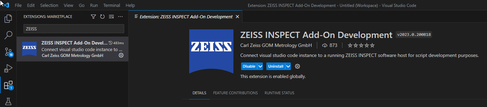
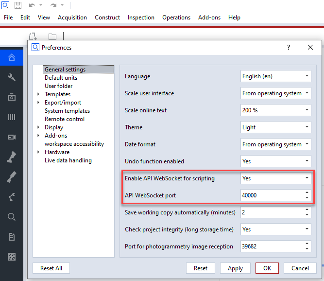
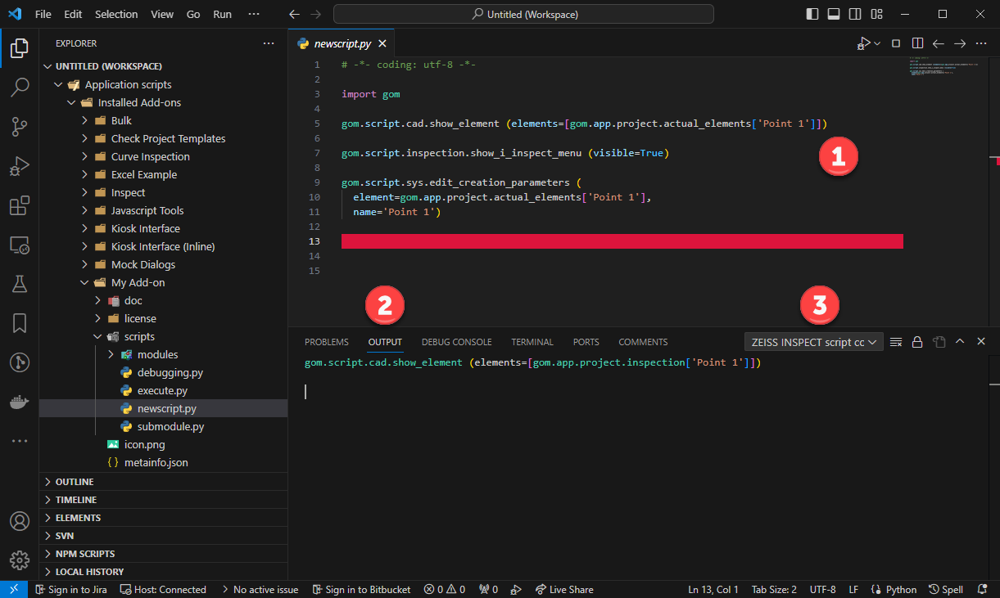
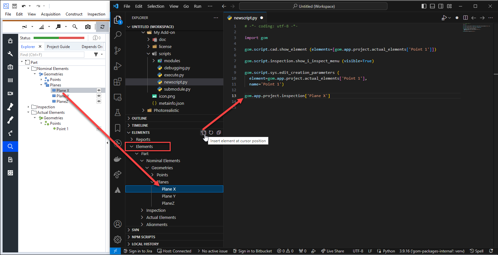
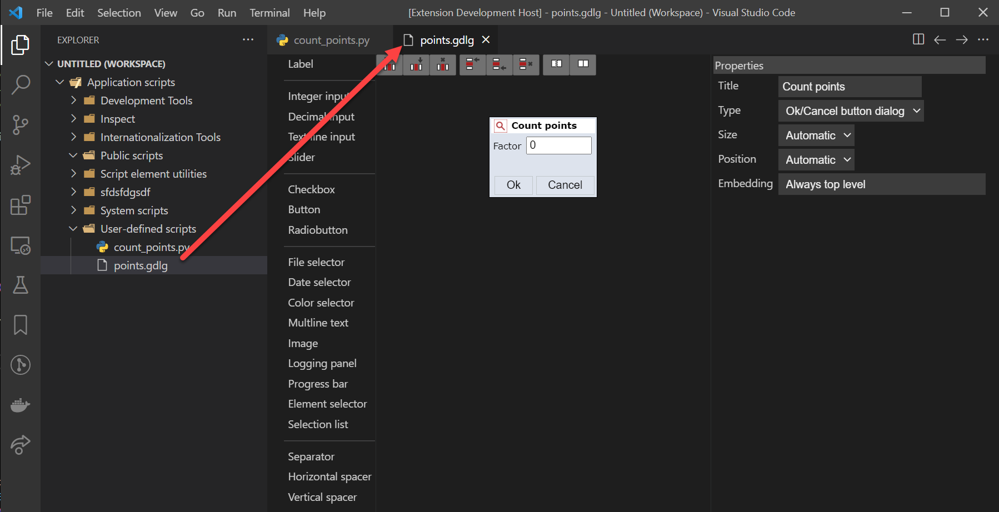
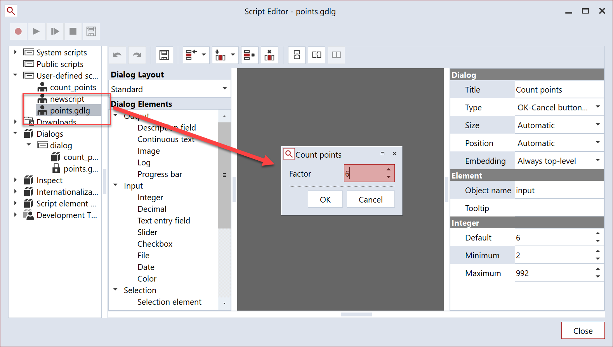

# Using Visual Studio Code as an add-on editor

## Setup

### Installation

1. Installation
   * Install the extension directly from the Visual Studio Code extension tab or from the marketplace. 
   * VSCode version 1.64 or higher is needed for this to work properly.

     

2. Configure connection
 
    * Ensure that the python API preferences in the GOM software are set up properly 
    
      
      
    * Ensure that the python API settings are correct in VSCode and are matching these in the GOM software: 
    
      

### Connecting

1. Have a GOM software running as a host
2. In the VSCode status bar, the connection status is displayed:

   
 
3. Press onto the "GOM host: Disconnected" status entry to connect to the host application.
4. After the connection has been established,
    * the connection status will reflect that and
    * the GOM softwares add-on editor content is mirrored and displayed in VSCode:
    
      

## Editing

### Creating scripts

1. Select 'New GOM script' from the file explorers right mouse menu.
2. Enter unique name for that script.

  

### Executing scripts

1. Select script to execute in the VSCode explorer.
    * The script can either reside in the mirrored application scripting database or be a local file from any other workspace location.
2. Select "Run script in GOM host" from the editors toolbar
3. The script outputs will be shown in the "debug console".

   

### Recording commands

1. Select the script to record commands into to show it in the editor.
2. In that editor, select "Record commands" from the editor toolbar.
3. Execute commands in the GOM application
    * The executed commands will be recorded in the currently edited VSCode script.
    * In addition, the "GOM script commands" subsection of the output tab shows a log of the executed commands.
    
      

4. For recording into a different position of the script, set the cursor to that line first or while recording.
5. Press "Record commands" again to stop command recording.

### Inserting elements

> Elements in the GOM applications are represented by 'element references' in the script. These are python expressions which, when executed, return a reference to that element.

1. When connected to a GOM application host, select the 'Elements' in the explorer view.
    * There, all elements in the project are listed.
2. Set editor cursor to the place the element should be into inserted into.
3. Select "Insert element into editor" from the top toolbar of the 'Elements' tab
    * You will get an 'element reference', an expression which, when, executed, returns the element referenced.
    
      

### Inserting keywords

> A keyword is an attribute used to query an element property. Various element attributes are existing depending on the element type.

1. Insert an element reference in the script as mentioned above.
2. After the element reference, press '.' to insert a point
    * A selection menu opens presenting the available keywords for that element
    
      

## Debugging

### Start debugging

1. Prepare debugged script as usual by setting breakpoints etc.

   

2. Start debugger by selecting "Debug script in GOM host" from the editor toolbar

   

3. Full VSCode debugging functionality can be used now, including

   

    * breakpoints and triggered breaks,
    * step over/in/out,
    * tracebacks,
    * variable inspection etc.

## User defined script dialogs

### Create new script dialog

1. Select "GOM Scripting: Insert new user defined script dialog" from the command selector or from the right mouse menu while editing the script the dialog should be inserted into.

   

2. Choose a name for the dialog file which will then be created.

   

3. The edited script will contain the necessary dialog commands then and a separate dialog definition file (*.gdlg) has been created.

   

4. Select the dialog definition file to open the build-in dialog editor. Edit dialog via drag/drop and configuration operations like in the applications script editor.

   

5. When the script is executed, the user defined script dialog is displayed.

   

6. In addition, dialog definition files (*.gdlg) can be viewed edit edited in the embedded script editor, too:

   

## FAQ

### Configuration

#### How do I set a shortcut to toggle the recording mode ?

* Select the "Keyboard Shortcuts" properties from the configurations menu:

  

* Assign the command "GOM Scripting: Toggle recording" to a key:

  

* The 'when' clause determines when the command is available. The correct 'when' clause here ist:

  resourceLangId == python && scriptingHostConnected

* If necessary, existing command bindings to that key can be removed here, too:

  

#### How do I set shortcuts for starting the current script in the GOM host ?

* See above for the general process.
* The relevant commands here are:
  * 'GOM Scripting: Run script in GOM host': Start the script.
  * 'GOM Scripting: Debug script in GOM host': Start the script with debugger attached.
* F9 / CTRL + F9 might be valid keys for that.

### Script editing

#### Can I use local workspaces from disk instead of the application script database for my project ?

* Yes.
* You can add arbitrary folders to the workspace and edit and starts scripts from right there.
* A limitation is that environments and packages cannot yet be handled by VSCode. As a workaround, the edited external folder can be added to the internal script editor, so that it can be processed from there:

  

### Dialog editing

#### I cannot edit all aspects of the user defined script dialogs in visual studio code ?

* The user defined script editor is under development and probably still missing various features.
* Workaround:
  * Create the dialog in VSCode. If features are missing...

    

  * ...continue editing the dialog in the build-in script editor.

    

### Troubleshooting

#### When using IntelliSense completion, the keyword list stalls

* When using the '.' or a hotkey to access the list of possible completions, a tooltip displays 'Loading...' but nothing happens:

  

* This bug is caused by the 'Microsoft Python' extension in connection with the script database filesystem.
* There is currently no fix, so disabling this extension is the only way here. This does not affect most python editor features:

  

#### When starting both the application and a script from within Visual Studio Code, crashes can happen

* This is more a GOM internal issue. When developing application code and script code at the same time from the same VSCode instance, this can happen.
* The parallel debugging session (application and scripting) seem to be the problem.
* Workaround: Do not start GOM application via the VSCode launcher, but e.g. from a command prompt.

