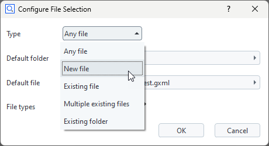

# Inserting a file selection dialog into a script

```{eval-rst}
.. feed-entry::
   :date: 2024-10-xx 9:00
```


With ZEISS INSPECT 2025, it is possible to add a dialog for selecting files or folders by using RMB ► Insert ► File... in the script editor. See <a href="../howtos/python_api_introduction/file_selection_dialog.md">Selecting a file or folder</a> for details.