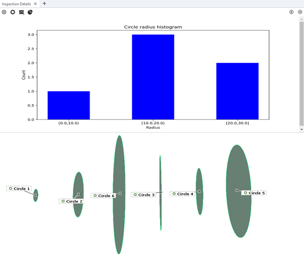

# Scripted Diagrams

```{eval-rst}
.. feed-entry::
   :date: 2024-12-17 13:00
```



Scripted diagrams have been added as a new feature in ZEISS INSPECT 2025. Scripted diagrams allow visualization of data provided by scripted elements in a very flexible way. 
More details can be found in <a href="../howtos/using_scripted_diagrams/using_scripted_diagrams.md">Using scripted diagrams</a>.