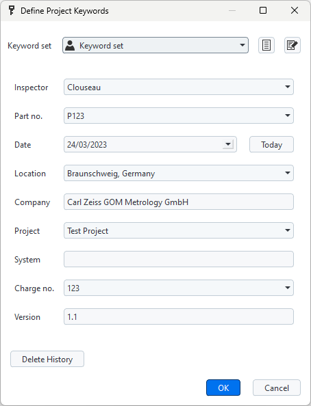

# CSV import/export example


## Short description

This example demonstrates how to read and write CSV files (comma separated values) from an App. The CSV file access is implemented using the [CSV Library](https://docs.python.org/3/library/csv.html) provided with the Python installation.

For demonstration purposes, project keywords are read from or written to a CSV file, but the example can be used as a template for other items.



## Prerequisite

Both example scripts check if a project has been opened and quit with an error message dialog if this is not the case:

```{code-block} python
if not hasattr(gom.app, 'project'):
    gom.script.sys.execute_user_defined_dialog (file='no_project.gdlg')
    quit(0)
```

## CSV read example: `csv_import.py`

The CSV module is imported:

```{code-block} python
import csv
```

The current project keywords and their values are listed:

```{code-block} python
print("-- Current keywords --")
for k in gom.app.project.project_keywords:
    print(f"{k}='{gom.app.project.get(k)}'")
```

A dialog is used to request the CSV file to be opened:

```{code-block} python
RESULT=gom.script.sys.execute_user_defined_dialog (file='import_file.gdlg')
```

The CSV file is opened and a `csv_reader` object for accessing its content is created:

```{code-block} python
with open(RESULT.file) as csv_file:
    csv_reader = csv.reader(csv_file, delimiter=';')
```

The class `csv.reader` allows some configurations, such as the column delimiter.

The scripts reads the CSV file line by line. Each line is provided as an array with the columns as its array elements. The first line is expected to contain a specific table header (`Project Keyword;Description;Value`). The remaining lines are used to create or change project keywords:

```{code-block} python
with open(RESULT.file) as csv_file:
    csv_reader = csv.reader(csv_file, delimiter=';')
    line_count = 0
    for row in csv_reader:
        # [...]
        key = row[0]
        desc = row[1]
        val = row[2]
        if line_count == 0:
            print(f'Column names are {", ".join(row)}')
            if key != "Project Keyword" or desc != "Description" or val != "Value":
                gom.script.sys.execute_user_defined_dialog (file='wrong_format.gdlg')
                quit(0)

        else:
            # Add or change project keyword (see below)
            # [...]

        line_count += 1
```

The keywords in the array `gom.app.project.project_keywords` have the prefix `user_`, but this prefix has to be removed for the method `gom.script.sys.set_project_keywords()`.

The script distinguishes the following cases:
1. The keyword in the Excel file is new
2. The keyword in the Excel file already exists, but its value has changed
3. The keyword in the Excel file already exists, but its description has changed
4. The keyword in the Excel file already exists and remains unchanged

```{code-block} python
ukw = "user_" + key
if not ukw in gom.app.project.project_keywords:
    print(f"New keyword {key}='{val}' added")
    gom.script.sys.set_project_keywords(keywords={key:val}, keywords_description={key:desc})
else:
    ex_val = gom.app.project.get(ukw)
    ex_desc = gom.app.project.get(f'description({ukw})')
    if (val == ex_val) and (desc == ex_desc):
        print(f"Existing keyword {key}='{val}' - not changed")
    else:
        if val != ex_val:
            print(f"Existing keyword {key}='{ex_val}' changed to '{val}'")
            gom.script.sys.set_project_keywords(keywords={key:val})
        if desc != ex_desc:
            print(f"Existing keyword {key} - description '{ex_desc}' changed to '{desc}'")
            gom.script.sys.set_project_keywords(keywords_description={key:desc})
```

Finally, the updated project keywords are listed:

```{code-block} python
print("\n-- Updated keywords --")
for k in gom.app.project.project_keywords:
    print(f"{k}='{gom.app.project.get(k)}'")
```

## CSV export example: `csv_export.py`

As in `csv_import.py`, the module `csv` is imported, the presence of an open project is checked and the user is requested to select a file for exporting.

The file is opened and the `keywords_writer` object is created. Some configuration settings are passed to the constructor. First, the header row is written using the method `writerow()` with an array containing the column headings. Next, a loop iterates over all project keywords and writes them to the CSV file using `writerow()`:

```{code-block} python
with open(RESULT.file, mode='w', newline='') as keywords_file:
    keywords_writer = csv.writer(keywords_file, delimiter=';', quotechar='"', quoting=csv.QUOTE_MINIMAL)

    # Header row
    keywords_writer.writerow(['Project Keyword', 'Description', 'Value'])

    for key in gom.app.project.project_keywords:
        val = gom.app.project.get(key)
        desc = gom.app.project.get(f'description({key})')

        # Remove prefix 'user_' from key
        key = key[5:]
        print(f"{key} - {desc}: {val}")

        # Special case - convert gom.Date to datetime-object
        if type(val) is gom.Date:
            val = datetime.datetime(val.year, val.month, val.day)

        # Write next row
        keywords_writer.writerow([key, desc, val])
```