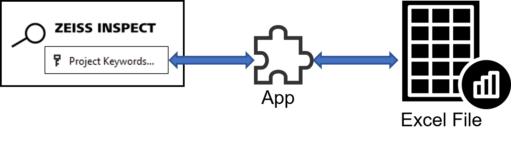
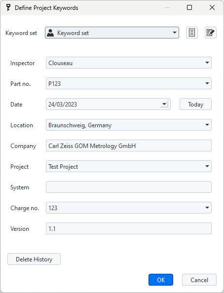

# Excel import/export example



## Short description

This example demonstrates how to read and write Excel files from an Add-on. The Excel file access is implemented using [openpyxl](https://pypi.org/project/openpyxl/). 

For demonstration purposes, project keywords are read from or written to an Excel file, but the example can be used as a template for other items.



## Prerequisite

Both example scripts check if a project has been opened and quit with an error message dialog if this is not the case:

```{code-block} python
if not hasattr(gom.app, 'project'):
    gom.script.sys.execute_user_defined_dialog (file='no_project.gdlg')
    quit(0)
```

## Excel read example: `import_project_keywords.py`

Two packages are imported from `openpyxl`:

```{code-block} python
from openpyxl import load_workbook
from openpyxl.utils.cell import coordinate_from_string, column_index_from_string
```

The current project keywords and their values are listed with:

```{code-block} python
print("-- Current keywords --")
for k in gom.app.project.project_keywords:
	print(f"{k}='{gom.app.project.get(k)}'")
```

A dialog is used to request the Excel file to be opened:

```{code-block} python
RESULT=gom.script.sys.execute_user_defined_dialog (file='dialog.gdlg')
print("\nOpening", RESULT.file)
```

The workbook is opened from the Excel file and a worksheet object `ws` is created:

```{code-block} python
wb = load_workbook(filename = RESULT.file)
ws = wb['Sheet']
```

As a tradeoff between simplicity and flexibility, the script allows to configure the cells which contain keywords, but assumes that the keyword descriptions and values are located at fixed positions in the adjacent cells:

```{code-block} python
# Cells containing the keywords
# - descriptions are expected in column+1
# - values are expected in column+2
layout = [
	"A2",
	"A3",
	"A4",
  #...
]
```

Cells can be accessed by their coordinates (e.g. "A1") or by row and column. The method `coordinate_from_string()` splits the coordinate into row and column (e.g. `coordinate_from_string("A1") => ("A", 1)`). The method `column_index_from_string()` converts a column name into 
a column index (e.g. `column_index_from_string("A") => 1`).

```{code-block} python
# Get keyword by cell name, e.g. cell="A1"
key = ws[cell].value

# Get column as a string
col, row = coordinate_from_string(cell)

# Get column index
col = column_index_from_string(col)

# Keyword description - next to keyword
desc = ws.cell(row=row, column=col+1).value

# Value - next to keyword description
val = ws.cell(row=row, column=col+2).value
``` 

In the array `gom.app.project.project_keywords`, the keywords have the prefix `user_`, but this prefix must be omitted for the method `gom.script.sys.set_project_keywords()`.

The script distinguishes the following cases:
1. The keyword in the Excel file is new
2. The keyword in the Excel file already exists, but its value has changed
3. The keyword in the Excel file already exists, but its description has changed
4. The keyword in the Excel file already exists and remains unchanged

```{code-block} python
ukw = "user_" + key
if not ukw in gom.app.project.project_keywords:
		print(f"New keyword {key}='{val}' added")
		gom.script.sys.set_project_keywords(keywords={key:val}, keywords_description={key:desc})
else:
    ex_val = gom.app.project.get(ukw)
    ex_desc = gom.app.project.get(f'description({ukw})')
    if (val == ex_val) and (desc == ex_desc):
        print(f"Existing keyword {key}='{val}' - not changed")
    else:
        if val != ex_val:
            print(f"Existing keyword {key}='{ex_val}' changed to '{val}'")
            gom.script.sys.set_project_keywords(keywords={key:val})
        if desc != ex_desc:
            print(f"Existing keyword {key} - description '{ex_desc}' changed to '{desc}'")
            gom.script.sys.set_project_keywords(keywords_description={key:desc})
```			

The steps described above are repeated for all Excel cells listed in `layout[]`:

```{code-block} python
for cell in layout:
    # Get keyword, description and value
    #...
    
    # Convert data type, if required
    #...
    
    # Add or update project keywords
    #... 
```

Finally, the updated project keywords are listed:

```{code-block} python
print("\n-- Updated keywords --")
for k in gom.app.project.project_keywords:
	  print(f"{k}='{gom.app.project.get(k)}'")
```

## Excel write example: `export_project_keywords.py`

Two packages are imported from `openpyxl`:

```{code-block} python
from openpyxl import Workbook
from openpyxl.styles import Font
```

The following code creates a workbook and writes text into three cells of the worksheet as a table header:

```{code-block} python
# Create a workbook
wb = Workbook()
	
# Select the active worksheet
ws = wb.active
	
# Create table header
ws['A1'] = "Project Keyword"
ws['B1'] = "Description"
ws['C1'] = "Value"
```

Next, the table header is formatted and the column widths are adjusted:

```{code-block} python
# Change table header layout
for cell in ['A1', 'B1', 'C1']:
  	ws[cell].font = Font(bold=True, size=16) 
    ws.column_dimensions['A'].width = 30
	  ws.column_dimensions['B'].width = 70
	  ws.column_dimensions['C'].width = 50
```

The script iterates over all project keywords and gets the values and keyword descriptions. A type conversion has been implemented for date entries. The method `ws.append([key, val, desc])` writes the variables `key`, `val` and `desc` - which are combined into an array - to the next three cells of the worksheet.

```{code-block} python
	for key in gom.app.project.project_keywords:
		val = gom.app.project.get(key)
		desc = gom.app.project.get(f'description({key})')

		# Remove prefix 'user_' from key
		key = key[5:]
		print(f"{key} - {desc}: {val}")
		
		# Special case - convert gom.Date to datetime-object
		# and format Excel cell accordingly 
		if type(val) is gom.Date:
			val = datetime.datetime(val.year, val.month, val.day)
			ws.append([key, desc, val])
			ws.cell(row=ws.max_row, column=2).number_format = "yyyy-mm-dd"
		else:
			ws.append([key, desc, val])
      
```

Specific cells can be selected with `ws.cell(row=<row>, column=<column>)`. This can be used for
* Changing the content: `ws.cell(row=ws.max_row+2, column=1).value = f'Exported from {gom.app.application_name}'`
* Setting the font: `ws.cell(row=ws.max_row, column=1).font = Font(size=8)`
* Adjusting the cell format: `ws.cell(row=ws.max_row, column=2).number_format = "yyyy-mm-dd"`
* etc.

Finally the prepared spreadsheet is written to a file. The file path has been requested previously with a dialog.  

```{code-block} python
wb.save(RESULT1.file)
```

To handle the common case that the Excel file cannot been written by the script, because it it currently opened in the Excel software, a loop with exception handling has been implemented:

```{code-block} python
# Repeat until file was written successfully or
# user has cancelled.
while True:
    try:
        # File selection dialog
        RESULT1=gom.script.sys.execute_user_defined_dialog (dialog={
            #...
        })
    except gom.BreakError:
        # User has cancelled
        break

    # ... create spreadsheet with project keywords ...
    
    # Try to write Excel file, this will fail if the file is still open in Excel!
    retry = False
    try:
        wb.save(RESULT1.file)
    except PermissionError:
        retry = True
        # Notification dialog
        RESULT=gom.script.sys.execute_user_defined_dialog (dialog={
            #...
        })

    if not retry:
        break
```
