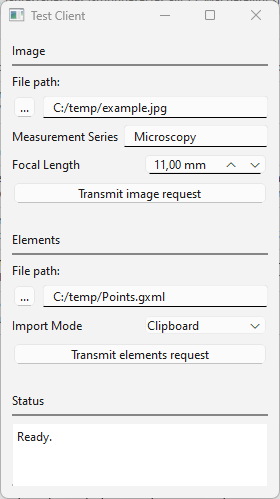

# ipc_sockets_example



## Short description

This example demonstrates Inter Process Communication between an external client and a server running as ZEISS INSPECT App using Internet sockets (aka BSD or Berkeley sockets).
The client send requests, which trigger execution of commands in ZEISS INSPECT, such as importing of images or elements from files. 

## Highlights

### 1. Request message format

The requests are encoded as JSON messages and terminated with an EOF (Ctrl-D) character.

**Import image from file**

Syntax: `{"image": {"file": \<image_file path\>, "name": \<measurement_series\>, "focal_length": \<focal_length_in_mm\>}}`


Example: `{"image": {"file": "C:/temp/example.jpg", "name": "other", "focal_length": "50.0"}}`


If the requested measurement series does not exist yet, is created with the command `gom.script.sys.create_measurement_series_for_other_images()`.

Then, the image is imported with the command `gom.script.sys.import_other_images()`.
   
**Import elements from file**

Syntax: `{"elements": {"file": \<elements_file_path\>, "import_mode": \<import_mode\>}}`, where `\<import_mode\>`: "clipboard" or "new_stage"

Example: `{"elements": {"file": "C:/Users/IQMPRINK/Documents/Points.gxml", "import_mode": "clipboard"}}`
   
The elements are imported with the command `gom.script.sys.import_gom_inspection_exchange()`.


**Responses**
The server responds with "O.k." if the request was decoded successfully, otherwise it sends an error message as plain text.

### 2. Socket server usage

Start the server script `TestServerApp.py` from the `IPCSocketsExample` App.

`TestServerApp.py` waits for a connection on the interface definded by `\<HOST\>` and `\<PORT\>` and expects request messages. After a connection has been set up, the server receives a request, sends a response and starts waiting for a new connection. Press `Esc` in the ZEISS INSPECT main window to stop the server.

### 3. Socket server implementation

Socket server communication code:

```{code-block} python
	with socket.socket(socket.AF_INET, socket.SOCK_STREAM) as s:
		"""Wait for connection from client"""
		s.bind((HOST, PORT))
		s.listen()
		conn, addr = s.accept()
		with conn:
			print(f"Connected by {addr}")
			
			while is_internet_socket_open(conn):
				"""Receive request"""
				buffer = ""
				while True:
					data = conn.recv(1024)
					if not data or data == EOF:
						break

					buffer += data.decode(encoding='utf-8')
					endPos =  buffer.find(EOF.decode('utf-8'))
					if endPos > -1:
						buffer = buffer[:endPos]
						break
				
				try:
					message = json.loads(buffer)
				except json.JSONDecodeError:
					response = "Error: Malformed JSON message.\r\n"
				else:
					"""Decode JSON message"""
					response = decodeMessage(message) + "\r\n"
					
				try:
					"""Send response"""
					conn.sendall(response.encode('utf-8'))
				except:
					pass
				
				"""Close client connection after sending response."""
				conn.shutdown(socket.SHUT_WR)
				conn.close()
				break
          

### 4. Socket client usage 

The test client `TestClientStandalone.py` is implemented as a standalone Python program with PySide 6 GUI.

As a prerequisite, install the PySide 6 package in your Python environment.
 
Export the client script from the App and start it from the Windows command line with `python TestClientStandalone.py`.

After selecting the request parameters in the GUI, click `Transmit image request` or `Transmit elements request`. This initiates setting up a connection to the server, transmitting the request, receiving the response and finally disconnecting from the server.

The server's response is printed in the text widget labelled 'Status'.

### 4. Socket client implementation

Socket client communication code:

```{code-block} python
def transmitReceive(payload):
	"""Socket communication

	Connect to server, transmit request, receive response and disconnect.
	
	Args:
		payload (bytes): Transmission payload
	"""
	with socket.socket(socket.AF_INET, socket.SOCK_STREAM) as s:
		try:
			s.connect((HOST, PORT))
		except ConnectionRefusedError:
			outputWidget.setText(f"Error: Cannot connect to server '{HOST}' port {PORT}.")
		else:
			s.sendall(bytes(payload.encode('utf-8')) + EOF)
			s.shutdown(socket.SHUT_WR)
			outputWidget.setText("Transmission completed.")
			response = s.recv(1024)
			outputWidget.setText(response.decode('utf-8'))
		s.close()
```


