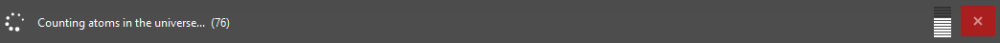

# progress_bar




## Short description

This example shows how to display a progress bar at the bottom of the ZEISS INSPECT main window.

There are two other variants of a progress bar:
* A specific API is available for showing <a href="../scripted_actuals/scripted_element_progress.html">Scripted elements progress</a> in the ZEISS INSPECT main window
* The <a href="../../howtos/python_api_introduction/user_defined_dialogs.html#progress-bar-widget">Progress bar widget</a> is used to show progress in a user-defined dialog.

## Highlights

The following code example shows a progress bar:

```{code-block} python
import gom.api.progress
import time

with gom.api.progress.ProgressBar() as bar:
	
    bar.set_message('Counting atoms in the universe... ')
    for i in range(100):
		# Pretend to be busy...
		time.sleep(0.1)
		
        # Increase the progress
		bar.set_progress(i)

	bar.set_message("Getting bored - stopping!")
	time.sleep(5)
```

* The progress bar is shown in a `with` context, which means that it will be removed if the `with` block is finished or aborted
* You define a text for the progress bar with the method `set_message()`. This text can be changed later.
* You set the stage of completion &mdash; which is shown as a number and as a vertical bar graph &mdash; with `set_progress()`

## Related

* <a href="../../python_api/python_api.html#gom-api-progress-progressbar">gom.api.progress.ProgressBar</a>
* <a href="../scripted_actuals/scripted_element_progress.html">Scripted elements progress bar</a>
* <a href="../../howtos/python_api_introduction/user_defined_dialogs.html#progress-bar-widget">User-defined dialogs - Progress bar widget</a>