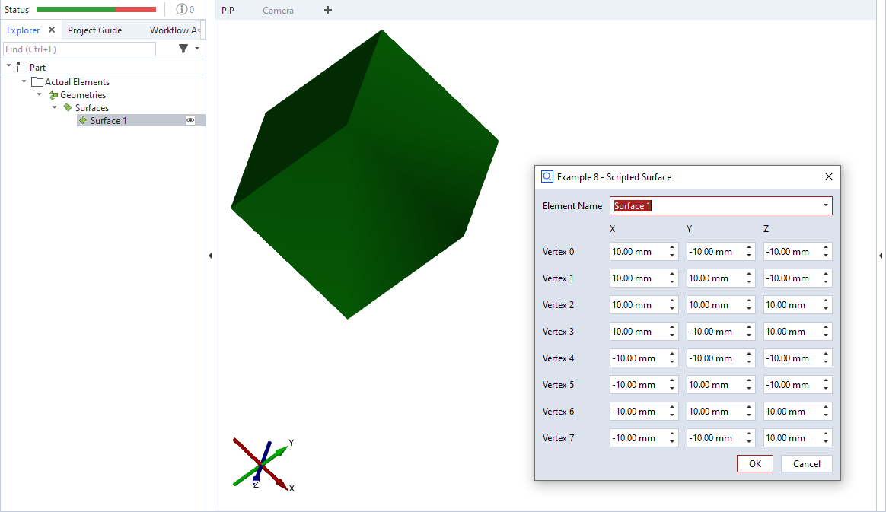

# scripted_actual_surface



This is an example for a scripted 'surface' element. The dialog allows to specify the coordinates of eight vertices defining a mesh. The triangles for defining the mesh are hard-coded in this example. The resulting body is a cuboid.

```{note}
The mesh triangles are defined by indices into the array of vertices. The vertices defining a triangle must be specified in counter-clockwise
order (as viewed from outside).
```

```{note}
Please see [offset_point_v2.md](offset_point_v2.md) for a complete scripted elements example with detailed description.
```


## Source code excerpt

```{code-block} python
---
linenos:
---
def dialog(context, params):
    #[...]

def calculation(context, params):
    valid_results = False
    v0 = gom.Vec3d(params['v0_x'], params['v0_y'], params['v0_z'])
    #[...]
    v7 = gom.Vec3d(params['v7_x'], params['v7_y'], params['v7_z'])

    # Calculating all available stages
    for stage in context.stages:
        # Access element properties with error handling
        try:
            context.result[stage] = {
                'vertices': [v0, v1, v2, v3, v4, v5, v6, v7],
                             # two triangles per side of the cuboid
                             # ----- front ------ , ----- right ------- , ----- top ----------
                'triangles': [(0, 1, 2), (0, 2, 3), (1, 5, 6), (1, 6, 2), (3, 2, 6), (3, 6, 7),
                             # ----- bottom ----- , ----- back -------- , ----- left ---------
                              (0, 1, 5), (0, 5, 4), (4, 5, 6), (4, 6, 7), (0, 4, 7), (0, 7, 3)]
            }
            context.data[stage] = {"ude_mykey": "Example 8"}
        except Exception as error:
            context.error[stage] = str(error)
        else:
            valid_results = True
    return valid_results
```

## Related

* [Scripted actuals - Surface](../../python_api/scripted_elements_api.md#surface)
* [How-to: User-defined dialogs](../../howtos/python_api_introduction/user_defined_dialogs.md)