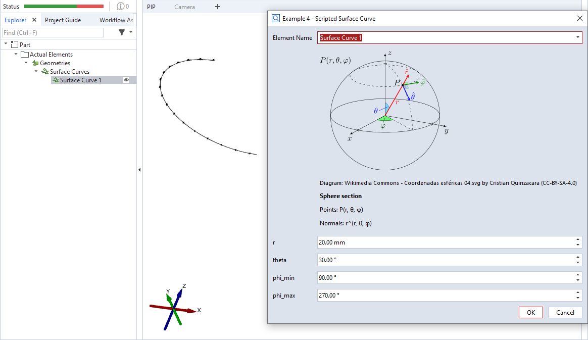

# scripted_actual_surface_curve



This is an example for a scripted 'surface curve' element. A parametric function is used to create a 3-dimensional surface curve - a section of a circle's parallel - with a fixed number of definition points. These point vectors are used as normals, too. `np.arange()` is used to iterate from `phi_min` to `phi_max` with a non-integer step size.

```{note}
Please see [offset_point_v2.md](offset_point_v2.md) for a complete scripted elements example with detailed description.
```


## Source code excerpt

```{code-block} python
---
linenos:
---
def dialog(context, params):
    #[...]

def calculation(context, params):
    valid_results = False

    # Calculating all available stages
    for stage in context.stages:
        # Access element properties with error handling
        try:
            # Creating a list of points using a parametric curve function:
            # P(t) = ( r * cos(theta) * cos(phi), r * cos(theta) * sin (phi), r * sin(phi) )
            # with
            #   theta = const
            #   phi in [phi_min...phi_max], 1000 steps
            points = []
            normals = []
            for phi in np.arange(params['phi_min'], params['phi_max'], (params['phi_max'] - params['phi_min']) / 1000):
                p = (
                    params['r'] * math.cos(params['theta']) * math.cos(phi),
                    params['r'] * math.cos(params['theta']) * math.sin(phi),
                    params['r'] * math.sin(params['theta'])
                )
                points.append(p)
                normals.append(p)
            context.result[stage] = [{'points': points, 'normals': normals}]
            context.data[stage] = {"ude_mykey": "Example 3b"}
        except Exception as error:
            context.error[stage] = str(error)
        else:
            valid_results = True
    return valid_results
```

## Related

* [Scripted actuals - Surface curve](../../python_api/scripted_elements_api.md#surface-curve)
* [How-to: User-defined dialogs](../../howtos/python_api_introduction/user_defined_dialogs.md)