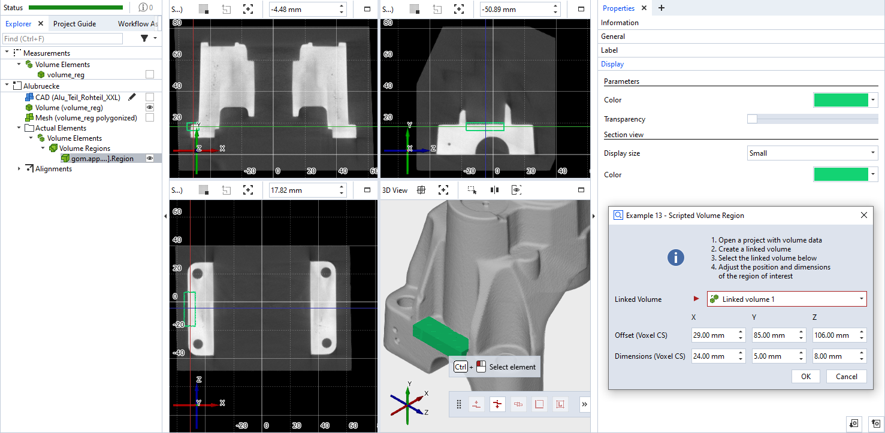

# scripted_actual_volume_region



This is an example for a scripted 'volume region' element. The dialog allows to select a linked volume element and to set offset (in the global coordinate system) as well as the dimensions (in the voxel coordinate system) of the volume region. In this example, the volume region is shown in light green.

```{caution}
The voxel (measurement) coordinate system may differ from the CAD coordinate system. 
```

```{note}
Please see [offset_point_v2.md](offset_point_v2.md) for a complete scripted elements example with detailed description.
```


## Source code excerpt

```{code-block} python
---
linenos:
---
def dialog(context, params):
    #[...]

def calculation(context, params):
    valid_results = False

    x0 = params['x0']
    y0 = params['y0']
    z0 = params['z0']

    dx = int(params['dx'] / params['volume_ele'].voxel_size.x)
    dy = int(params['dy'] / params['volume_ele'].voxel_size.y)
    dz = int(params['dz'] / params['volume_ele'].voxel_size.z)

    # Calculating all available stages
    for stage in context.stages:
        # Access element properties with error handling
        try:
            context.result[stage] = {
                'volume_element': params['volume_ele'],
                'offset': gom.Vec3d(x0, y0, z0),
                'voxel_data': np.ones((dx, dy, dz), dtype=np.uint8)
            }
            context.data[stage] = {"ude_mykey": "Example 13"}
        except Exception as error:
            context.error[stage] = str(error)
        else:
            valid_results = True
    return valid_results
```

## Related

* [Scripted actuals - Volume region](../../python_api/scripted_elements_api.md#volume-region)
* [How-to: User-defined dialogs](../../howtos/python_api_introduction/user_defined_dialogs.md)